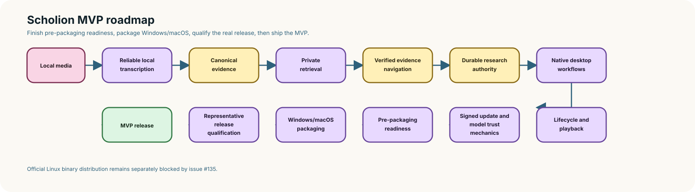

# Scholion roadmap 🗺️✨

Scholion is becoming a **private local workspace for recorded evidence**. Its job is not to out-engine every speech-recognition runtime. Its job is to make local transcription dependable, resumable, inspectable, searchable, navigable, annotatable, portable, and safe on ordinary computers while keeping source evidence and human-authored knowledge under clear custody.

Modern Scholion restarted on August 2, 2026. The project has moved from “can we transcribe a file?” through a substantial backend foundation into a native desktop that can import, process, make an explicit embedded-audio-track choice, search, verify, annotate, inspect speakers/provenance, publish derived transcript views, play exact verified source evidence, and review/apply custody-aware storage changes. This roadmap is a productization map, not a class inventory.


<details>
<summary>Static diagram fallback if rich rendering is unavailable</summary>



</details>

Text fallback: Scholion already spans local media, reliable transcription, explicit embedded-track selection, canonical evidence, lexical/semantic/hybrid retrieval, verified navigation, durable research, lifecycle contracts and desktop controls, incremental refresh, remembered locations, native import, Processing, Library, Research, transcript/speaker tools, verified native playback, an accessible multi-theme shell, architecture/redundancy consolidation, and the Scholion identity migration. The next first-release work is finishing supply-chain trust, packaging/first-run/update/uninstall, portability, packaged semantic custody, and representative-device qualification.

# First-release foundation now

“Foundation” means the authority exists in code and is protected by tests. It does not mean installers and representative-device qualification are finished.

## Local processing, audio tracks, and model custody

Scholion inspects effective CPU/memory and accelerator topology before admitting a local strategy. FFprobe owns bounded media inspection; `AudioStreamSelector` owns deterministic exact-stream selection; FFmpeg owns canonical normalization and optional deterministic enhancement. Managed model installation is explicit, records the immutable provider revision actually installed, and locally revalidates repository/revision/layout expectations before transcription.

Do not collapse that current local custody contract into the stronger word “trusted.” The #110 foundation now defines project-owned policy trust for an exact upstream revision plus the complete allowed file set, byte sizes, SHA-256 values, source/license metadata, and fail-closed verification. Production faster-whisper acquisition still needs to be wired to those curated entries before the desktop may call a model policy-trusted.

The Processing Center presents readiness, model state, preflight, supervised start/cancel, durable job status, checkpoint resume, fresh retry, private execution-state discard, bounded public task failures, in-place model task activity, and speaker-labeling capability gating. Python remains authoritative for planning, admission, model custody, stream-selection validation, resume compatibility, and transcript correctness. Tauri owns allowlisted long-running child-process lifetime. React submits intent and presents state.

A single-audio-stream source requires no choice. If preflight discovers several embedded audio streams and no explicit index was supplied, Python marks the plan as requiring stream confirmation. The desktop promotes a semantic track chooser into the ordinary preflight surface, shows only bounded source-declared title/language/default plus basic media facts, and keeps Start disabled. Choosing a track sends its exact integer index back to Python, which re-runs preflight before the choice is considered confirmed.

The source labels are clues, not recommendations or identity. Canonical provenance records the exact audio-stream index that entered transcription, and checkpoint resume restores it. This capability covers several embedded streams inside one source file; synchronized separate recording files remain a different evidence-model problem.

See **[Audio tracks](docs/audio-tracks.md)**, **[Processing Center](docs/architecture/processing-center.md)**, **[Local model management](docs/architecture/model-management.md)**, and **[Signed update and model trust channel](docs/security/update-model-trust.md)**.

## Canonical evidence and transcript tools

Canonical JSON is authoritative transcript evidence. It retains source/execution provenance, source-relative segment and word timing, language evidence, optional anonymous speaker evidence, and enhancement provenance. TXT, SRT, and WebVTT are deterministic publications, not transcript authority.

The desktop transcript-tools tranche is implemented. Library results can open generation-bound tools for transcript/source availability and provenance, selected stream inspection, human display-name editing, explicit overlap/mixed/unattributed speaker presentation, and post-hoc TXT/SRT/WebVTT publication.

Every transcript-tool operation carries `(document_id, canonical_sha256)`. Python refuses stale generations rather than letting a long-lived UI silently mutate newer speaker numbering. React never parses canonical JSON or receives canonical/source paths.

See **[Transcript and speaker tools](docs/transcript-tools.md)** and **[Speaker display names](docs/speaker-names.md)**.

## Verified native playback

The desktop can play original local audio/video from the same verified source-relative cursor used by evidence navigation.

Playback is generation-bound rather than path-driven. Python verifies canonical bytes, source identity, current source SHA-256/size, duration bounds, and audio-stream identity. Rust opens only the approved source, narrows the verification/open race with metadata checks, stores the opened file behind an opaque session ID, and serves bounded byte ranges through the dedicated `scholion-media` protocol.

Multi-track transcription is explicitly supported. Multi-track playback fails closed until the native layer can prove the rendered stream matches canonical provenance.

See **[Verified native playback](docs/native-playback.md)**.

## Retrieval and durable research

The library has a database-neutral retrieval contract, DuckDB lexical projection, BM25-style ranking, optional semantic chunks/embeddings, hybrid reciprocal-rank fusion, and exact-generation evidence identity.

Search ranking and evidence navigation remain separate. A ranked passage becomes precise evidence only after Scholion verifies canonical generation and resolves exact segment/word coordinates.

Authoritative SQLite owns evidence notes, tags, collections, anchor history, and saved-search intent. DuckDB research/search state is rebuildable. The desktop supports note create/edit/delete, tag/collection navigation, one typed saved-question lifecycle, typed Research search, exact-generation return, and explicit stale-anchor review/re-anchor.

Today's `ResearchNote` always has an exact evidence anchor. A future freeform notebook/memo should be a separate authoritative research-document class with optional explicit evidence references rather than weakening that invariant with nullable provenance.

## Safe lifecycle and locations

Deletion is preview-first and plan-bound. The native Storage workspace presents backend-computed requested/effective scopes, concrete action descriptions, preserved-note counts, affected saved-search counts, and exact reviewed confirmation. Source-recording deletion requires its own scope, a second UI guard, and provenance verification.

Retention is intentionally narrower. Storage can preview old private processing workspaces, identify interrupted/failed candidates whose resume capability would be lost, and apply the exact plan. It does not age-delete canonical transcripts, source media, published transcripts, human research, or lightweight lifecycle manifests.

Remembered recording/transcript locations are durable permissions. Recording discovery itself does not hash, probe, copy, or transcribe candidate media. Automatic processing remains a separate explicit policy.

## Desktop presentation and accessibility

The desktop architecture remains:

```text
Scholion Desktop
├── React + TypeScript + Vite     presentation
├── Tauri / Rust                  narrow native capability host
└── Python Scholion               application and evidence rules
```

The shell has eight skins: **Archive, Midnight, Paper, Moss, Plum, Ember, Pride, and Monochrome**. All use one semantic token contract for surfaces, text, controls, focus, errors, selection, and accent foregrounds. Theme preference is local presentation state and never evidence/research state.

# Capability → desktop audit

| Capability | Authority | Desktop status | Remaining first-release work |
|---|---|---|---|
| Machine/resource policy | Python runner/admission | implemented | representative-device calibration |
| Model custody | managed revision + local revalidation; policy-trust primitives exist | implemented current custody, trust foundation implemented | #110 real curated entries + production install/revalidation/admission gate |
| Import/locations | durable permissions/discovery | implemented | settings/forget polish |
| Processing | plan, execute, checkpoint, resume/retry | implemented | representative native task qualification under #114 |
| Embedded audio tracks | Python probe/selector/planner + FFmpeg exact map | implemented explicit desktop confirmation | future proven multi-track playback; separate-file sync remains out of scope |
| Enhancement/diarization intent | Python plan/execution | implemented with capability gating | result polish continues through transcript view |
| Canonical JSON | authoritative evidence | implemented consumer views | packaging/backup |
| Speaker labels | generation-bound human state | implemented desktop management | optional organization polish |
| Speaker transcript | backend derived presentation | implemented | playback-linked reading available through evidence view |
| Provenance/details | canonical verified inspection | implemented | richer troubleshooting optional |
| TXT/SRT/WebVTT | deterministic derived publication | implemented post-hoc desktop flow | optional export organization |
| Lexical/semantic/hybrid search | private retrieval | implemented | packaged semantic custody |
| Verified evidence navigation | exact generation + timing/seek | implemented | representative-device playback qualification |
| Notes/tags/collections | SQLite authority | implemented | optional management polish; freeform memos later as separate object type |
| Saved searches | durable typed intent | implemented | optional organization polish |
| Safe deletion/retention | typed plan-bound Python custody | implemented desktop Storage plan/apply | representative-device/path qualification |
| Native source playback | generation/source authorization + Rust session | implemented | decoder/device qualification; future proven multi-track selection |
| Themes/accessibility | semantic palette + browser/native controls | 8 skins qualified | representative OS/forced-colors checks |
| Architecture/redundancy | capability-blind transport + centralized composition + one Research contract | complete | release/API migration only where compatibility is intentionally broken |
| Frontend tests | strict TS/build + Playwright/axe | primary surfaces + playback + multitrack + lifecycle covered | grow with features, avoid duplicated backend policy |
| Update trust | exact-byte signed manifest + rollback/expiry/model-policy primitives | foundation implemented | #110 native verifier/key, fixed endpoint, staged artifact checks, product UI |
| Packaging | Python wheel + source Tauri | development only | managed runtime/installers/update/uninstall; Linux public package blocked by #135 |
| Backup/restore | authority boundaries known | none | manifest/reconcile/restore UI |
| Representative hardware | policy contracts + platform CI | partial | real 8/16 GB, Apple/dGPU/high-DPI; #114 CPU-only + accelerator task transport |

# Product critical path

## 1. Research/search complete

The first-release Research circuit is coherent: find evidence → verify → annotate → organize → save/replay a question → return to exact evidence → deliberately maintain an anchor when necessary.

## 2. Processing Center complete

The first Processing control loop exists over readiness, model state, durable jobs, preflight, explicit embedded-track confirmation, launch, native supervision, cancel, resume versus retry, private-state discard, bounded task outcomes, model task feedback, and speaker-labeling capability gating.

The ordinary control loop is implemented. Issue #114 remains open only for representative **native** CPU-only and accelerator-capable task-transport qualification; browser mocks cannot satisfy that evidence requirement.

## 3. Desktop comprehension + theme system complete

Ordinary users see human search language rather than Python/database vocabulary. The theme system has one registry, semantic tokens, local persistence, explicit browser schemes, native-control theming, and eight-skin contrast/a11y qualification.

## 4. Transcript and speaker tools complete

Generation-bound backend services own speaker names, overlap-aware presentation, provenance/details, and deterministic post-hoc publication. React submits intent and never becomes canonical authority.

## 5. Native playback complete

Verified source-relative evidence coordinates drive local audio/video without giving React arbitrary path authority. Python owns generation/source/stream authorization. Rust owns the opened file handle, opaque session lifetime, and bounded local-media transport.

## 6. Lifecycle + retention UI complete

The Storage workspace productizes existing custody contracts without creating a second deletion policy. Source recording removal has a second guard and backend provenance verification. Retention exposes age policy, completed-only defaults, optional failed/interrupted inclusion, explicit resume-loss warnings, preview, and plan-bound application.

## 7. Architecture/redundancy audit complete

The architecture/redundancy audit is closed. It consolidated capability-blind Python stdin/stdout mechanics, moved application-service construction into `AppContainer`, migrated bounded frontend desktop/Processing calls onto one fixed-command protocol helper, collapsed duplicate Research saved-question ingress, centralized Research evidence serialization/label invariants, and retained separate playback/custody/long-task boundaries where authority actually differs.

The audit deliberately does **not** create a generic bridge, arbitrary Python-module selector, dynamic Tauri command dispatcher, frontend policy framework, or universal Pydantic hierarchy. Similar-looking code remains only where security visibility, lifecycle semantics, readability, or compatibility justify it.

A pre-package follow-up retired the deprecated runner `ModelTier` and `recommended_model_tier` wire field before they could become a released compatibility contract. Runner policy now describes only processing intent and resource/admission limits; concrete transcription strategy ranking remains the sole model-selection authority. No canonical evidence, authoritative research, or checkpoint format depended on the removed marker.

See **[Architecture and redundancy audit](docs/architecture/redundancy-audit.md)**.

## 8. Product identity checkpoint complete

The first-release product identity is **Scholion**. The Python package/CLI, environment prefix, desktop package, Tauri product/window identity, bundle identifier, playback protocol, frontend copy, tests, tooling, and documentation now use the Scholion identity before installer/update compatibility is frozen.

A rename affects more than the GitHub repository label. Audit and intentionally migrate:

- product/CLI/module/package/display names;
- Tauri bundle identifiers and executable names;
- app-data/cache/model/output directory names;
- installer/update-channel/signing identities;
- documentation/examples and generated artifacts;
- environment variables and integration points; and
- migration/compatibility behavior for existing local Scholion workspaces.

The identity surface is documented in **[Product identity](docs/product-identity.md)**. Future changes must be explicit migrations and must never silently move, delete, or invalidate authoritative user evidence.

## 9. Supply-chain trust + packaging + first run/update/uninstall ← next

Finish issue #110 before calling the update/model channel production-ready:

- choose and pin a reviewed native signature verifier and production public key(s);
- implement the fixed-endpoint manual **Check for updates** action;
- persist highest trusted sequence locally without transmitting an identifier;
- stage artifacts and enforce signed size/SHA-256 before platform-safe activation;
- keep periodic checks separately opt-in;
- review real faster-whisper upstream revisions and generate the production curated trust catalog;
- require the exact curated revision and full file-set/size/SHA-256 match before model registration/admission; and
- expose integrity/revalidation versus Scholion policy trust accurately under technical details.

Then ship a managed Python runtime/sidecar, FFmpeg/native dependencies, Windows/macOS/Linux delivery, storage onboarding/repair, signed updates, and evidence-safe uninstall semantics.

Public **Linux** packaging remains blocked by issue #135 while the supported Tauri Linux graph still contains the GTK3-era `glib 0.18.5` unsoundness. Do not “fix” that by forcing unsupported GTK/GLib overrides underneath Tauri. Adopt a stable/reviewed upstream-supported runtime when available, remove the temporary RustSec allowlist, and requalify Linux Wayland/X11/native flows.

Packaging must not silently move/delete user evidence. Uninstall should remove application/runtime/cache state according to explicit rules while preserving original recordings, canonical transcript evidence, and authoritative research unless the user separately requests destruction.

## 10. Backup/restore + research portability

Back up canonical evidence and authoritative research, rebuild projections on restore, reconcile machine-local paths, and export selected research with stable evidence identity.

Design the authority manifest so a later freeform `ResearchDocument`/memo class can be added without pretending current evidence notes are unanchored. Export formats are derived views; the backup manifest is about stable authority and relationships.

## 11. Packaged semantic custody

Lock/qualify embedding dependencies, immutable model acquisition, private cache/offline behavior, corpus compatibility, and upgrade semantics as an ordinary product feature.

## 12. Representative-device qualification

Qualify 8 GB Windows, 16 GB commodity systems, Apple Silicon, dGPU laptops, 32/64 GB systems, Unicode/long paths, external disks, low disk, crashes, interrupted downloads, offline use, upgrades/reinstall, scaling, native controls, media codecs, keyboard use, forced colors, and accessibility.

Issue #114 specifically remains open until the real worker/task transport is recorded on representative CPU-only and accelerator-capable machines. Browser Playwright is presentation evidence, not a substitute for React → Tauri → Rust → Python qualification.

This is where “my friend can put a random video in and it works” becomes an evidence-backed claim rather than an architectural expectation.

# Later research-native work

Freeform research memos/notebook pages, snapshots/diffs, REFI-QDA interoperability, evidence packets, comparison workspaces, evidence-linked writing/script boards, portable research bundles, and live provisional capture remain intentionally separate from the first-release path.

A future notebook page should live in authoritative SQLite as its own research-document type with optional explicit references to evidence notes/anchors. It should not weaken the current `ResearchNote` invariant by making its evidence anchor optional. DuckDB can later project memo text/relationships for search, and Markdown/plain-text/HTML/research-bundle exports can remain derived views.

The sequencing rule remains simple: do not build a larger research superstructure while the ordinary desktop still needs supply-chain completion, packaging, portability, and real-device qualification.