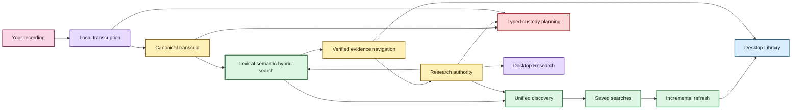
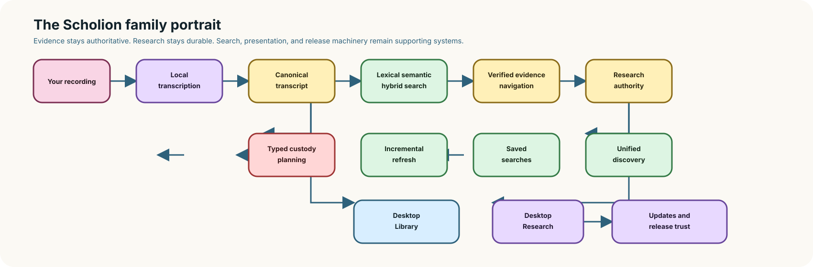

# Welcome to Scholion 🦝✨

Scholion is a **private, local-first workspace for recorded evidence**.

It can inspect a recording, choose a safe way to run on the computer you actually have, transcribe locally, survive interruptions, preserve provenance, search a private corpus, navigate results back to verified canonical evidence, keep research notes attached to that evidence, save reusable research questions, manage generation-bound speaker labels, inspect transcript provenance, publish derived transcript views, play verified local source evidence, and manage storage through reviewed custody plans in a native desktop shell.

You do **not** need to understand CUDA, DuckDB, SQLite, BM25, model revisions, or desktop IPC to use the product. Those are implementation details. The desktop should speak in recordings, transcripts, searches, notes, processing, speakers, playback, storage, and evidence. Persistent in-app guidance explains the unusual concepts at the point of use instead of assuming this documentation is open beside the app.

> **The short version:** your recording stays yours, canonical JSON remains inspectable evidence, your notes/speaker names/saved searches remain your knowledge, and most machinery built around those things can be thrown away and rebuilt.

## What can Scholion do today?

| You want to… | Scholion currently… |
|---|---|
| Transcribe privately | runs faster-whisper locally from a model you explicitly install and Scholion revalidates locally before use |
| Avoid melting a smaller laptop | inspects effective CPU/RAM and compatible acceleration before choosing a strategy |
| Process from the desktop | provides readiness, model state, preflight, supervised start/cancel, progress, resume versus retry, and private-state discard |
| Survive interruption | checkpoints completed work and validates the original contract on resume |
| Keep the original intact | treats source media as read-only during normal processing and writes artifacts separately |
| Handle audio/video | selects one audio stream deterministically, requires an explicit user choice when a file contains multiple audio tracks, and canonicalizes the chosen track locally |
| Understand several embedded tracks | shows bounded source-declared title/language/default metadata, then re-runs backend preflight with the exact selected stream |
| Clean noisy audio | optionally applies deterministic local suppression with provenance/timeline checks |
| Work across languages | supports multilingual decoding plus conservative local language attribution |
| Distinguish speakers | preserves anonymous recording-scoped speaker evidence without claiming identity |
| Name known speakers | stores human display names separately and binds them to the exact canonical generation |
| Read handoffs/overlap | presents single-speaker, overlap, mixed, and unattributed spans without flattening uncertainty |
| Inspect a transcript | shows verified generation, selected audio stream, source availability, and processing provenance |
| Publish useful formats | produces canonical JSON plus rebuildable TXT/SRT/WebVTT, including post-hoc desktop publication |
| Search a private corpus | supports lexical BM25, optional semantic retrieval, hybrid RRF, and inspectable Research search options |
| Follow a result to evidence | verifies canonical generation and returns justified segment/word/context/seek coordinates |
| Play the cited recording | re-verifies the exact transcript generation and source before opening an opaque native audio/video session; multi-track sources currently refuse playback rather than risk the wrong embedded track |
| Keep durable research | stores evidence-anchored notes/tags/collections in authoritative private SQLite |
| Reuse questions | stores and edits full typed saved-search intent, then re-resolves current evidence |
| Remember libraries | persists explicit transcript/recording permissions without copying user media |
| Refresh an evolving corpus | incrementally reconciles changed canonical generations and can verify tracked evidence |
| Remove something safely | previews backend-calculated custody scopes/actions, requires an exact plan-bound confirmation, and gives source media its own second guard |
| Clean old processing state | previews eligible private workspaces and marks resumable interrupted/failed jobs before cleanup |
| Understand an unfamiliar screen | keeps re-openable, keyboard/touch-accessible contextual help in the app instead of relying on hover-only tips |
| Change appearance | offers Archive, Midnight, Paper, Moss, Plum, Ember, Pride, and Monochrome through one accessible Theme picker |

### Model trust in plain language

Today, model installation is explicit. Scholion records the immutable provider revision it received, keeps that managed state local, and revalidates the expected local snapshot structure before using the model. That is **not yet the same thing** as Scholion policy approving an exact upstream revision and every byte by cryptographic hash.

The stronger supply-chain contract tracked in issue #110 adds that policy layer: a signed Scholion release carries the curated model policy, installs request the exact approved upstream revision, and the downloaded file set, sizes, and SHA-256 values must match before the model can be called policy-trusted. Hugging Face remains transport, not the trust authority.

Ordinary product copy should explain consequences such as “downloads only when you choose,” “stays on this computer,” and “works offline after installation.” Repository/source/revision/hash details belong under technical details or the security documentation rather than in the main workflow.

## Pick your doorway

- **[Getting started](getting-started.md)** for the source-build path, desktop path, and first transcript.
- **[Audio tracks](audio-tracks.md)** for single-track behavior, explicit multi-track selection, source-declared track labels, canonical stream provenance, and the current playback limitation.
- **[In-app guidance](in-app-guidance.md)** for the persistent help controls and why they describe rather than duplicate backend policy.
- **[Processing Center](architecture/processing-center.md)** for the desktop processing authority split.
- **[Transcript and speaker tools](transcript-tools.md)** for generation-bound details, speaker management, overlap presentation, and post-hoc publication.
- **[Verified native playback](native-playback.md)** for source re-verification, opaque media sessions, exact seek coordinates, and the multi-audio fail-closed rule.
- **[Storage and lifecycle controls](storage-lifecycle.md)** for plan-first transcript custody, source protection, private-state retention, and native boundary details.
- **[Find things across the whole local library](library-discovery.md)** for grouped Library discovery.
- **[Research search](research-search.md)** for Match, Search options, saved searches, and the typed backend contract beneath the ordinary UI.
- **[Your notes should survive the machinery](research-notes.md)** for evidence notes, tags, collections, saved research intent, anchor maintenance, and the future freeform-notebook distinction.
- **[From search result to the exact evidence](evidence-navigation.md)** for verified canonical navigation and the evidence reader/cursor.
- **[Transcript time without calculator gymnastics](time-navigation.md)** for timeline and source-relative coordinates.
- **[Give the anonymous speakers names](speaker-names.md)** for human-authored display labels and generation semantics.
- **[Semantic search, without the mystery box](semantic-search.md)** for local semantic/hybrid retrieval.
- **[Signed update and model trust channel](security/update-model-trust.md)** for the concrete update/model supply-chain contract and its privacy boundary.
- **[Desktop themes and accessibility](development/desktop-accessibility.md)** for the eight-skin semantic token system and contrast qualification.
- **[Frontend testing strategy](development/frontend-testing.md)** for frontend/backend test ownership and mutation policy.
- **[Architecture and redundancy audit](architecture/redundancy-audit.md)** for the completed architecture/redundancy consolidation and intentional remaining boundaries.
- **[Safe deletion and retention](architecture/safe-deletion-retention.md)** for the underlying custody contract.
- **[Post-MVP research roadmap](post-mvp-roadmap.md)** for later research-native workflows.
- **[SECURITY.md](../SECURITY.md)** for the repository security boundary.
- **[Architecture](architecture/README.md)** and **[Development docs](development/)** for maintainers.

## The Scholion family portrait

Static diagram fallback if rich rendering is unavailable

Text fallback: canonical evidence feeds rebuildable search; search resolves back to verified evidence; durable notes/tags/collections, speaker labels, and saved searches remain authoritative human knowledge; lifecycle and refresh reuse those identities; the desktop Processing, Library, transcript-tools, playback, Research, and Storage surfaces consume the same application authorities.

## What belongs to you, and what can the raccoon rebuild? 🦝

| Data | What it is | Rebuildable? |
|---|---|---|
| Original recording | source evidence | **No** |
| Canonical transcript JSON | authoritative transcript evidence | **No** |
| Speaker display labels | user-authored knowledge | **No** |
| Research notes, tags, collections, anchors | user-authored knowledge | **No** |
| Saved searches | user-authored query intent | **No** |
| Remembered locations | machine-local app preference | **No, but reconcile on another machine** |
| Theme preference | presentation preference | Yes / non-evidence |
| TXT / SRT / WebVTT | publication views | Yes |
| Normalized/enhanced working audio | private processing material | Yes |
| Checkpoint workspace after publication | execution/recovery state | Usually disposable |
| Lexical/semantic/research databases | derived projections | Yes |

If deleting a search projection destroys unique human-authored information, something has gone very wrong.

## The desktop today

Research/search, the Processing Center, desktop comprehension/themes, transcript/speaker tools, verified native playback, re-openable contextual guidance, and custody-aware Storage are now coherent first-release slices.

Research uses ordinary product language by default. Processing presents backend planning/admission rather than duplicating it. If a source contains several embedded audio tracks, Python tells the desktop that explicit selection is required; React presents bounded track facts and submits the chosen stream index, then Python replans before Start is enabled. Transcript tools pass exact generation identity into Python for details, speaker mutation, and publication. Playback does the same for source authorization, then Rust owns an opaque opened-file session.

Storage follows the same rule. React sends only typed lifecycle intent and renders a plan calculated by `LibraryCustodyService`. A dedicated Tauri command invokes only the fixed custody bridge. Action paths and private workspace paths are removed before responses reach the webview. Applying a plan sends the exact reviewed token back to Python, which recalculates and refuses stale state.

The sidebar keeps **How this screen works** and **How Scholion works** available after first use. Evidence, playback, transcript tools, multi-track preflight, and Storage add local explanation at the point where their semantics become unusual. The help registry and inline copy are presentation only; they never substitute for Python application policy.

Appearance remains one compact picker. All eight skins share the same semantic text/control/focus contract and the same registry-driven contrast/a11y matrix.

The architecture/redundancy audit is closed. Capability-blind Python/frontend transport is shared, application composition belongs to `AppContainer`, the duplicate Research saved-question ingress is gone, and remaining similar-looking Rust/adapter code has an explicit authority, lifecycle, readability, security, or compatibility reason to remain separate.

## What comes next

The Scholion identity migration is complete. The next critical path is:

1. finish the #110 signed-update and policy-trusted-model integration, then package first-run/update/uninstall behavior; public Linux packaging remains gated by #135 until the supported Tauri stack leaves the affected GTK3/GLib graph;
2. backup/restore and selected research portability;
3. packaged semantic custody; and
4. representative-device qualification, including the remaining native CPU-only/accelerator task-transport evidence from #114.

A future freeform notebook/memo capability belongs in later Research work as a second durable research-object class, not as evidence notes with optional/missing provenance.

Only after the first desktop product is coherent do the deliberately separate **[post-MVP research features](post-mvp-roadmap.md)** become normal roadmap work.

See **[ROADMAP.md](../ROADMAP.md)** for the capability audit and detailed sequencing. Editorial/Mermaid rules live in **[documentation-style.md](documentation-style.md)**.