# Scholion architecture 🔧

Welcome to the maintenance hatch.

The user-facing docs explain what Scholion does. These pages explain **why the boundaries
exist, what each capability owns, what it refuses to own, and which invariants must survive
refactors**.

If you are trying to transcribe a file rather than maintain the system, use
**[Getting started](../getting-started.md)**.

## The shape of the system

Scholion is composed from narrow local capabilities in
`src/scholion/app/app_container.py`. The through-line is custody: source evidence,
canonical transcript truth, private execution state, rebuildable projections, durable human
knowledge, native process/media lifetime, and desktop presentation deliberately do not share
authority semantics.



[Diagram source (Mermaid)](../diagrams/src/system-shape.mmd)

Text fallback: canonical JSON is evidence; DuckDB ranks rebuildable views; canonical
navigation verifies evidence; SQLite owns human research; `ResearchWorkspaceService`
composes research interactions; `ProcessingCenterService` composes machine/model/job,
preflight, and explicit embedded-track confirmation authority; the versioned desktop bridge
feeds current Library, Research, and Processing presentation; `LibraryCustodyService` keeps
destructive policy separate. Verified playback and lifecycle Storage each use separate fixed
Python-to-Rust paths rather than widening the general bridge.

## Where to look

| Page | What question it answers |
|---|---|
| [Processing capabilities](processing-capabilities.md) | How does the local transcription/research system fit together? |
| [Processing Center](processing-center.md) | How does the desktop expose readiness, preflight, embedded-track choice, jobs, and long-running native work without becoming the scheduler? |
| [Architecture and redundancy audit](redundancy-audit.md) | Which duplicated seams were consolidated before identity/packaging, and which similarities are intentionally retained? |
| [Audio tracks](../audio-tracks.md) | How does Scholion choose among several embedded audio streams without guessing or confusing transcription with playback? |
| [Verified native playback](../native-playback.md) | How does exact-generation evidence become a local media capability without exposing paths to React? |
| [Storage and lifecycle controls](../storage-lifecycle.md) | How does the desktop expose plan-bound custody and retention without giving React filesystem authority? |
| [Adaptive heterogeneous execution](adaptive-heterogeneous-execution.md) | How does Scholion decide what this machine can safely run? |
| [Media and timeline](media-and-timeline.md) | Which source/stream did we use, and what do timestamps mean? |
| [Word-level timestamp alignment](word-alignment.md) | How do engine timings become source-relative evidence? |
| [Local model management](model-management.md) | Which model revision is allowed to execute, and how did it get here? |
| [Speech enhancement](speech-enhancement.md) | How can preprocessing affect ASR without becoming source truth? |
| [Anonymous speaker diarization](diarization.md) | How are speaker turns represented without pretending anonymous labels are identities? |
| [Corpus search](corpus-search.md) | How do lexical/semantic/hybrid ranking and verified navigation stay separate? |
| [Durable research state](research-state.md) | Why does SQLite own human research while DuckDB owns rebuildable acceleration? |
| [Library lifecycle](library-lifecycle.md) | Where does canonical JSON live, what does rebuild/refresh scan, and which state is durable? |
| [Library locations](library-locations.md) | What does “remember this folder” persist, and what does discovery refuse to do? |
| [Incremental library refresh](incremental-library-refresh.md) | How does the corpus reconcile without a full rebuild? |
| [Safe deletion and retention](safe-deletion-retention.md) | What exactly can be deleted, what is preserved, and how is destructive intent confirmed? |
| [Desktop themes/accessibility](../development/desktop-accessibility.md) | How do all skins share one semantic token and contrast contract? |
| [ROADMAP](../../ROADMAP.md) | What is implemented, what is next, and what remains later? |
| [SECURITY](../../SECURITY.md) | What does the security boundary actually claim? |

## Package map

| Package / surface | Responsibility |
|---|---|
| `app` | Dependency-injection composition root and application-facing processing/research-search composition |
| `core` | Configuration, errors, observability, health, measurements |
| `interfaces` | Local filesystem/storage adapters and private-storage policy |
| `media` | Read-only source inspection, bounded embedded-track display metadata, and deterministic audio-stream selection |
| `runner` | Process-visible CPU/memory inspection and execution-budget policy |
| `model_management` | Model inventory, acquisition, verification, provenance, removal |
| `transcription` | Planning, normalization, enhancement, segmentation, ASR, checkpoints, language, alignment, diarization, assembly, exports |
| `workspace` | Private job paths and public artifact allocation |
| `benchmarking` | Privacy-minimized local execution measurement |
| `library` | Retrieval, evidence navigation, playback authorization, research authority/projections, saved searches, discovery, refresh, locations, typed custody policy |
| `desktop` | Versioned allowlisted Python bridges over shared capability-blind host transport plus fixed private playback and lifecycle custody bridges |
| `frontend` | React/TypeScript presentation over typed desktop operations and fixed-command protocol transport; no direct DB/filesystem/media-probe/custody authority |
| `src-tauri` | Thin native host/capability boundary for dialogs, allowlisted long-running child processes, fixed Python bridge commands, opened playback sessions, and bounded local media transport |

## Capability boundaries

Scholion prefers a small object with one clear job over a universal manager.

The search/research/custody/processing/desktop area deliberately separates responsibilities:

1. `TranscriptLibraryService` discovers and ranks rebuildable transcript passages.
2. `EvidenceLocator` verifies ranked passages against canonical evidence.
3. `SpeakerLabelService` owns durable recording-scoped human display names without rewriting diarization evidence.
4. `ResearchStateStore` owns durable evidence notes, tags, collections, and exact evidence anchors.
5. `ResearchStateProjector` converges authoritative SQLite state into a disposable DuckDB research projection.
6. `ResearchProjectionIndex` owns fast derived research constraints and summaries.
7. `WorkspaceMetadataStore` owns durable saved-search intent and computes disposable navigation views.
8. `ResearchWorkspaceService` composes those capabilities for CLI and presentation adapters.
9. `ResearchSearchControlService` owns typed Research search/saved-question application semantics and is composed by `AppContainer` rather than rebuilt by the desktop adapter.
10. `LibraryLocationService` owns remembered directory permissions and cheap recording discovery without becoming a media processor.
11. `LibraryCustodyService` owns typed deletion planning/execution and age-based private execution-state retention.
12. `ProcessingCenterService` composes health/resource/model/job/preflight authority, including whether multi-track preflight requires explicit user confirmation, and is composed by `AppContainer`.
13. `PlaybackAuthorizationService` verifies exact canonical generation, current source bytes, coordinate bounds, and stream identity before native media can open.
14. `scholion.desktop.host_protocol` owns only bounded JSON stdin/stdout mechanics and the versioned envelope; individual bridges retain method/service/error authority.
15. `scholion.desktop.bridge` exposes the ordinary allowlisted versioned IPC surface for Library/Research/Processing.
16. The playback bridge is private to a fixed Rust host path and cannot be redirected to an arbitrary Python module.
17. `scholion.desktop.custody_bridge` exposes only document listing, deletion plan/apply, and retention plan/apply through a dedicated fixed Tauri command; it strips action/workspace paths before serialization.
18. Tauri supervises allowlisted long-running native child processes, owns opaque opened playback sessions, and invokes fixed Python modules. It owns process/file lifetime, not strategy selection, stream selection, model validity, transcript correctness, or custody policy.
19. React owns interaction and presentation only. It does not issue SQL, mutate DuckDB/SQLite directly, select canonical generations, inspect media, choose a preferred audio track by policy, or decide effective deletion/retention policy.

That split must survive future UI convenience work. Presentation convenience is not
permission to merge custody boundaries.

## Why SQLite and DuckDB both exist

SQLite is authoritative for irreplaceable, frequently mutated user research. DuckDB is
used for rebuildable analytical/query projections. There is one authority, not two masters.

```text
SQLite authority
      |
      | monotonic transactional change journal
      v
ResearchStateProjector
      |
      v
DuckDB research projection
```

If a research projection disappears, rebuild it. If SQLite user state disappears, unique
human work is lost. That asymmetry is intentional.

Saved searches live in authoritative SQLite because they are authored intent. Their runtime
evidence scope does not. Replaying a saved search re-resolves the current corpus and current
research relationships.

A future freeform research memo/notebook should also be authoritative SQLite state, but as a
separate research-document class rather than an evidence note with a nullable anchor. That
keeps “this is my synthesis” distinct from “this prose is attached to these exact canonical
coordinates.”

## Desktop presentation does not rename authority

The desktop intentionally translates internal vocabulary into ordinary product language.
For example, Research presents one **Match** choice while the backend keeps separate
phrase/operator properties, and it calls lexical/semantic/hybrid **Wording / Meaning /
Wording + meaning**.

That translation is presentation only. Python still validates/canonicalizes the typed
request, derives research evidence scope, chooses retrieval behavior, and verifies evidence.
Similarly, all eight UI skins share semantic CSS tokens; theme selection cannot alter
backend requests, evidence identity, or research state.

Embedded-track presentation follows the same rule. Python decides whether explicit stream
confirmation is required and validates the requested stream. React can display bounded
source-declared title/language/default metadata and collect a radio-button choice, but it
cannot turn those labels into a recommendation or skip backend re-preflight.

Storage follows the same principle. React offers understandable custody scope labels and a
second source acknowledgment, but `LibraryCustodyService` computes scope expansion, action
sets, note preservation, saved-search effects, source provenance checks, retention
eligibility, resume-loss flags, and the plan-bound confirmation token.

## The custody rules 🦝

1. **Original media is source evidence and read-only during normal processing.** Explicit source deletion is separate and provenance-checked.
2. **Canonical transcript JSON is authoritative transcript evidence.**
3. **The exact selected embedded audio-stream index is part of transcription provenance. Source-declared track labels are descriptive clues, not identity.**
4. **Managed model manifests describe verified local execution dependencies.**
5. **Lexical, semantic, and research DuckDB databases are rebuildable projections.**
6. **Speaker labels, notes, tags, collections, and saved searches are human-authored authority and do not inherit index deletion semantics.**
7. **Research joins include canonical generation identity, not a friendly segment ID alone.**
8. **Precise navigation resolves to verified canonical evidence rather than trusting a stale search projection.**
9. **Research filters apply before ranking/scoring when they define eligible evidence.**
10. **Saved searches persist typed query intent, not a frozen derived evidence scope.**
11. **Canonical deletion preserves attached notes and document-scoped saved searches unless their own destructive scopes are explicitly selected.**
12. **Age-based retention can delete only private job workspaces.**
13. **Remembered locations are permissions/pointers, not copies of user media.**
14. **The desktop webview receives typed presentation DTOs and opaque playback handles, not arbitrary filesystem paths or database handles.**
15. **Lifecycle plan DTOs omit deletion paths and private workspace paths.**
16. **Long-running native process supervision does not create a second job or checkpoint authority.**
17. **Verified playback authorization does not turn an opaque media session into source/evidence authority.**
18. **Theme/presentation state is machine-local preference, not evidence or research state.**
19. **Scholion does not claim secure erasure it cannot prove.**

Search infrastructure may disappear. User-authored knowledge may not disappear by accident.

## Current application seams

Unified discovery, saved searches, frequent/recent navigation, and research interactions
compose through `ResearchWorkspaceService`. Typed Research search/saved-question application
semantics compose through `ResearchSearchControlService`. Both are supplied through
`AppContainer`; the desktop adapter does not construct a second application graph.

Processing composes through the container-owned `ProcessingCenterService`; Tauri owns only
the native lifetime of allowlisted long-running tasks. Multi-track confirmation is returned
by Python preflight, and a user choice is rebound through Python before execution.
Resume/retry semantics remain Python application policy.

Bounded trusted-host bridges share `scholion.desktop.host_protocol`. On the frontend,
ordinary desktop/Processing bounded requests, transcript tools, Research anchor maintenance,
and lifecycle calls share `nativeProtocol.ts` with a closed Tauri-command union. Playback
and supervised Processing task commands remain separate because they return different
contracts and carry different lifetime authority.

Verified playback composes through `PlaybackAuthorizationService` plus the private fixed
playback bridge. Rust opens the approved file, retains it behind an opaque active session,
and serves bounded byte ranges through `scholion-media`. React does not receive the path.
Multi-track playback deliberately fails closed until the native layer can prove the rendered
embedded stream.

Incremental corpus growth composes through `TranscriptLibraryService.refresh(...)` and
remembered roots through `LibraryLocationService`. Full `library rebuild` is an explicit
repair/recovery lever, not a normal “one file changed” workflow.

Custody-sensitive operations remain separate through `LibraryCustodyService`:

```bash
scholion library delete TRANSCRIPT_ID --scope library-view
scholion library delete TRANSCRIPT_ID --scope canonical-transcript
scholion library retention --execution-days 30
```

The native Storage workspace exposes the same plan/apply contract through the dedicated
custody bridge. Deletion and retention remain preview-first. Applying a reviewed operation
requires the exact plan-bound token; execution recalculates the plan and refuses changed
state. React never receives the destructive filesystem paths.

The **pre-identity architecture/redundancy audit is complete**. The next product seam is the
identity migration before packaging freezes bundle IDs, executable/module/package names,
app-data locations, sidecar contracts, environment variables, and update/uninstall behavior.

## New abstraction test

Before adding a manager, framework, registry, adapter hierarchy, generalized plugin system,
or database wrapper, ask which concrete capability or invariant it protects.

File count is not an architectural problem. Repeated policy, unclear ownership, and
unprovable invariants are.

The same applies to frontend styling: eight skins do not justify eight component palettes.
One semantic role should have one meaning and eight token values.

## Documentation contract

Architecture pages should provide a plain-English doorway, a structural model when useful,
the exact implementation contract, ownership/failure semantics, and explicit current
limits or future seams.

Mermaid diagrams use direct GitHub-supported fenced syntax and the approved Scholion
palette; color helps hierarchy but never carries the only meaning. See
**[documentation-style.md](../documentation-style.md)** for the editorial and visual
contract.
