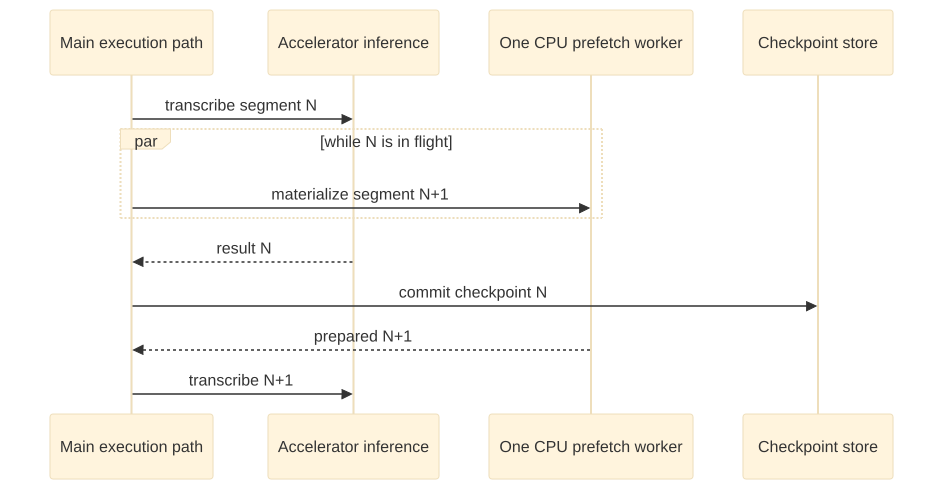

# Adaptive heterogeneous execution 🖥️✨

Status: implemented architecture; representative-device qualification pending  
Last updated: August 17, 2026

## The human version

Scholion should use the computer in front of it **without asking the user to become a
hardware scheduler**.

A small Windows laptop, an Apple Silicon machine, a desktop with a discrete GPU, and a
large workstation do not have the same resources. More importantly, “a GPU exists” does
not mean the installed speech engine can actually use it.

So Scholion separates the problem into four questions:

1. **What compute and memory can this process really see?**
2. **What can the installed engine/runtime really execute on?**
3. **Which concrete strategy safely fits the current budgets?**
4. **Can we overlap a little preparation work without breaking resume or ordering?**

For an ordinary user, the intended outcome is simple: Scholion chooses a sensible local
strategy, refuses impossible explicit requests, and does not pretend that a detected
accelerator is magic extra RAM.


[Diagram source (Mermaid)](../diagrams/src/adaptive-execution-overview.mmd)

No tensor-sharding opera is hiding behind this diagram. The current system is
purposefully narrower.

## Why the distinction matters

CPU cores and accelerators **execute work**. System RAM and accelerator memory provide
capacity for model weights, buffers, audio, queues, and intermediate state. Those roles
are related but not interchangeable.

A machine with 16 GiB of unified memory does not suddenly contain 32 GiB because the GPU
can also see it. Scholion models the physical budget rather than summoning fictional
memory from the spreadsheet dimension.

## Resource discovery

`RunnerInspector` is authoritative for process-visible CPU and system-memory capacity.
It accounts for relevant constraints including:

- CPU affinity;
- Linux cgroup CPU quotas;
- Linux cgroup memory ceilings; and
- current process-visible free memory.

`HardwareTopologyInspector` adds independent accelerator evidence.

Accelerator memory has an explicit topology:

- **dedicated**: a distinct device-memory pool such as discrete NVIDIA VRAM;
- **shared/unified**: consumes the same physical capacity available to the host and must
  also count against the system-memory budget; and
- **unknown**: not guessed safe. A strategy requiring unknown device-memory capacity
  fails admission.

That distinction protects ordinary machines from double-counting memory simply because
an accelerator API reports a second view of the same pool.

## Physical hardware is not engine capability

A visible accelerator is necessary but not sufficient for accelerated execution.

The runtime may not support the driver, operating system, device API, or compute type.
Scholion therefore keeps engine-specific capability knowledge behind
`EngineCapabilityRegistry` providers.

The planner receives concrete execution targets such as:

```text
cpu:0   + int8
cuda:0  + float16
cuda:0  + int8_float16
```

The application planner itself does not contain NVIDIA, CUDA, Metal, DirectML, ROCm, or
OpenVINO policy.

The first physical accelerator probe uses `nvidia-smi` because faster-whisper's
CTranslate2 runtime can consume CUDA. Discovery is optional and lightweight. A missing
command, broken driver, timeout, malformed response, or runtime import failure degrades
to a CPU-capable machine instead of preventing Scholion from starting.

CTranslate2 capability inspection remains separate. A CUDA strategy is eligible only
when physical device evidence **and** installed runtime capability agree on the exact
device and compute type.

🦝 A GPU may live under the floorboards. Scholion still asks whether it has a job.

## Strategy admission

`StrategyDefinition` describes a concrete execution choice:

- engine;
- model;
- device;
- compute type;
- optional accelerator backend;
- estimated system-memory requirement;
- optional device-memory requirement;
- quality rank; and
- performance rank.

`StrategyEvaluator` is deterministic. It does not benchmark during planning and does not
infer performance from marketing names.

For dedicated accelerator memory, Scholion reserves headroom before admission. The
initial budget is **80% of currently free device memory**. This is a conservative
heuristic pending representative-device measurements.

For shared/unified memory, the accelerator requirement is also charged against system
RAM. Unknown device-memory availability is not treated as safe.

### Explicit means explicit

If a user explicitly selects a strategy and it is no longer available or safe, Scholion
returns a typed resource-admission failure.

It does **not** silently swap the explicit request for something else.

Automatic selection may choose a suitable CPU strategy when acceleration is unavailable.
CPU/int8 remains the reference compatibility path.

## Why bounded pipeline overlap comes before model sharding

Scholion owns media preparation, deterministic segmentation, checkpointing, transcript
assembly, enrichment, and publication. It does not own the tensor graph inside every
speech engine.

Splitting one model across CPU and GPU would couple the application to engine-specific
partitioning behavior, introduce transfer overhead, complicate packaging, and make
recovery semantics harder to reason about.

The first concurrency optimization is therefore much less glamorous and much easier to
prove:



[Diagram source (Mermaid)](../diagrams/src/bounded-pipeline-overlap.mmd)

The invariants are:

1. at most one future materialized segment exists;
2. segment `N` is checkpointed before `N+1` can become committed work;
3. there remains one job-scoped inference session and one ordered checkpoint writer; and
4. completed checkpoints form a contiguous prefix of the deterministic segment plan.

## CPU and storage accounting for prefetch

Prefetch is not free.

When an accelerated strategy has more than one safe CPU thread, Scholion may reserve one
thread for segment preparation and give the remaining threads to inference.

If only one effective CPU thread is available, acceleration may still run, but prefetch
depth becomes zero and materialization stays sequential. Scholion does not oversubscribe
a cgroup or affinity-constrained CPU budget merely so a diagram can contain the word
“parallel.”

Storage admission mirrors that boundedness:

- CPU/sequential execution admits one materialized segment;
- accelerated execution with prefetch admits current + one future materialized segment;
- if prefetch is disabled, the estimate returns to one segment.

The storage estimate therefore describes the maximum temporary segment files the
scheduler can actually own.

## Failure cleanup

If future work has not started when a failure occurs, it can be canceled before a file
exists.

If future materialization has started or completed, unconsumed prepared audio is cleaned
while unwinding. Cleanup failure is logged but does not mask the primary error.

The current segment remains owned by the main execution path and is cleaned there.

This protects the resume invariant rather than treating speculative work as completed
state.

## Re-admission when the world changes

Planning is not a permanent reservation.

Before model initialization, Scholion rechecks CPU/system-memory capacity. Accelerated
execution also performs fresh accelerator and engine-capability checks.

A GPU that disappears, loses enough free VRAM, or becomes unsupported after planning
causes a safe refusal.

Resume restores the original engine/device/compute contract and re-admits it on the
current machine rather than silently changing execution placement.

Scheduling details that are **not transcript identity**, such as prefetch depth, may
become more conservative when current CPU headroom shrinks, provided the immutable
engine and checkpoint requirements still fit.

## What still needs empirical qualification

Current memory estimates and performance ranks are conservative heuristics. They are not
a claim that a particular laptop/GPU/compute type is faster under sustained real use.

Representative-device qualification should measure:

- engine/model/device/compute type;
- cold and warm model behavior;
- process-tree peak RSS and CPU use;
- stage timings and real-time factor;
- thermal effects on longer recordings;
- accelerator memory/utilization where reliable counters exist;
- whether reserving a CPU preparation thread improves throughput; and
- recovery behavior when CPU, RAM, or device-memory availability contracts.

The intended future rule is **measure the machine, not the logo on the machine**.

## Privacy and security

Topology and capability detection are local. Scholion does not need to upload hardware
inventory, recordings, transcripts, or benchmark results to choose a strategy.

Accelerator discovery uses fixed argument vectors without a shell. Routine user-facing
errors do not expose arbitrary driver output. Capability inspection does not authorize
model downloads.

Model acquisition remains a separate explicit boundary under local model management.

## Compatibility rule

CPU/int8 remains the fallback and reference compatibility contract.

Future accelerator backends should plug into the same topology, capability, strategy,
observer, checkpoint, and application-runner seams instead of teaching the CLI or
transcription core about hardware brands.

The stable rule is:

> **detect resources → negotiate real engine capability → admit a concrete strategy →
> keep checkpoint semantics independent of where inference runs.**

That is the whole little hardware cabaret. 💃