# Evidence-first corpus search 🔎🦝

Status: lexical, semantic/hybrid, canonical evidence navigation, research-aware filtering,
unified discovery, saved searches, incremental refresh, and desktop Library presentation
implemented. A dedicated desktop Research workspace is next.  
Last updated: August 19, 2026

## The human version

A transcript library should help you find **what was said** without quietly replacing your
evidence with a database, vector store, or generated answer.

Scholion supports three transcript retrieval modes:

| Mode | Best when… | Example |
|---|---|---|
| Lexical | you remember actual words, names, acronyms, or identifiers | `rent increase` |
| Semantic | you remember the idea but not the wording | `people struggling to afford housing` |
| Hybrid | exact terminology and conceptual similarity should support each other | research across a mixed corpus |

Retrieval ranks a passage. A separate navigation layer verifies the exact canonical
transcript generation and resolves that passage back to canonical segments and aligned
words. A research-workspace layer can decorate or constrain those results using durable
notes/tags/collections without teaching the search index that human-authored knowledge is
transcript truth.

> **Canonical transcript JSON is evidence. SQLite research state is human-authored truth.
> DuckDB search/research databases are rebuildable projections.**

[Diagram source (Mermaid)](../diagrams/src/corpus-search-overview.mmd)

Text fallback: canonical transcript evidence produces rebuildable lexical/semantic search
state; ranked passages are re-verified against canonical evidence; authoritative SQLite
research state accelerates constraints through a disposable DuckDB projection; grouped
discovery feeds CLI and desktop Library today, with desktop Research next.

## Durability classes

**Authoritative evidence:** original recording and canonical transcript JSON.

**Authoritative user knowledge:** speaker labels, notes, tags, collections, and saved
searches.

**Rebuildable views:** lexical/semantic indexes, chunks/vectors, derived research
relationships, retrieval statistics, and presentation context/highlights.

If every DuckDB file disappeared, Scholion should reconstruct query acceleration without
losing unique evidence or human-authored research.

## Canonical hashing and stale-state refusal

The lexical projection records both `source_sha256` and `canonical_sha256`. Semantic
generations record a `corpus_fingerprint` derived from sorted `(document_id,
canonical_sha256)` pairs.

Before exposing precise canonical words or segments, `EvidenceLocator` re-reads canonical
JSON and verifies SHA, document identity, and source identity against the ranked passage.
Stale indexed evidence fails closed.

[Diagram source (Mermaid)](../diagrams/src/canonical-hashing-stale-refusal.mmd)

Text fallback: ranked passages must still match the canonical generation and segment set;
otherwise precise navigation refuses instead of fabricating evidence.

## Lexical retrieval

`DuckDbTranscriptIndex` stores ordinary document, segment, and term-statistic tables and
computes deterministic BM25-style ranking without DuckDB FTS.

`SearchQuery` covers text, phrase/ANY/ALL semantics, speaker/language/document/timeline
constraints, limits, sorting, and optional `evidence_scope`. User values remain
parameterized; the storage adapter owns SQL.

## Semantic and hybrid retrieval

ASR segments are evidence coordinates, not automatically ideal retrieval units. Scholion
combines adjacent canonical segments into deterministic search chunks that retain complete
segment identity and source-relative time.

The current semantic profile targets local Multilingual E5 Small with explicit dimensions,
normalization, pooling, distance, query/passage transforms, chunking profile, and immutable
revision. Provider output is validated before replacing valid semantic state.

`DuckDbSemanticIndex` stores vectors as `FLOAT[]`, not opaque BLOBs, and performs an exact
scan over eligible chunks. Hard filters apply before top-K. ANN/HNSW should appear only if
measured corpus size justifies approximation.

Hybrid retrieval combines ranks using reciprocal rank fusion rather than pretending BM25
and dense scores share one trustworthy scale.

## Canonical evidence navigation

`EvidenceLocator` returns exact canonical/source identity, result segment IDs,
source-relative start/end, deterministic `seek_seconds`, canonical speaker refs, justified
aligned-word matches, and bounded canonical context.

Lexical results may expose exact words. Semantic-only results do not fabricate that
precision. The desktop Evidence reader consumes a path-minimized DTO and can move an
evidence cursor among canonical timed words without pretending the React surface is already
a media player.

## Research constraints and unified discovery

`ResearchWorkspaceService` can constrain transcript search using tags, collections, note
text, and `with_notes`. Research constraints resolve to canonical evidence scope **before**
BM25 or semantic scoring.

`evidence_scope = None` means no research restriction. `evidence_scope = ()` means the
restriction matched nothing and search must return nothing.

Unified discovery is implemented across transcript evidence, authoritative notes, tags,
and collections. The groups do not compete on a fabricated universal relevance scale. CLI
and desktop Library both consume this composition.

The desktop bridge strips raw canonical/source filesystem paths while retaining the
document/generation/segment/time identity needed for evidence presentation.

## Saved searches are implemented

Saved searches belong to authoritative SQLite user state because they are authored query
intent. They persist typed search/research/retrieval choices, not a frozen evidence scope.
Running one re-resolves current corpus and research relationships.

Graphical browsing/running/editing of saved searches belongs in the next desktop Research
workspace tranche.

## Incremental library refresh

Normal corpus growth no longer requires full rebuild. Incremental refresh compares cheap
canonical metadata first, validates/hashes changed or new canonical bytes, applies an
atomic lexical delta, reconciles moved/external paths, and invalidates semantic state when
corpus generation identity changes.

`--verify` deliberately reopens every tracked canonical to detect same-size/mtime
modification. Full rebuild remains the repair/recovery lever.

## Current deliberate limits

The current search/navigation/workspace system does not provide generated corpus answers
as the primary interface, arbitrary-model CLI selection, a normal packaged semantic extra,
ANN/HNSW or learned reranking, selected/exportable result-set objects, automatic
cross-generation note re-anchoring, local audio/video playback, a dedicated desktop
Research workspace yet, complete advanced query controls in the desktop UI, cross-recording
biometric identity, or source separation for overlapping speech.

> **Search may become smarter. The result should remain inspectable evidence, not an
> uncited answer floating above the corpus.**
