# Durable library locations and recording discovery

Status: durable location permissions, cheap recording discovery, transcript-root refresh,
and the first Tauri/React import presentation are implemented.  
Last updated: August 19, 2026

Scholion lets a user work in two modes without confusing them:

1. **one-time selection**: choose particular recordings or canonical transcripts and do
   not remember the containing directory; and
2. **remembered locations**: explicitly grant Scholion permission to revisit a directory
   at later application lifecycle points.

Remembering a location is durable application preference state. It is not transcript
evidence, research annotation state, or permission to copy/delete the user's source files.



[Diagram source (Mermaid)](../diagrams/src/library-locations.mmd)

Text fallback: explicit selection can remain one-time or become a remembered location;
remembered transcript roots feed incremental canonical refresh, while remembered recording
roots only discover candidates. Discovery does not itself start ASR.

## Custody and storage

Remembered locations are stored privately at:

```text
<STATE_DIR>/library/user-state/library-locations.json
```

The file is schema-versioned, validated fail-closed, written atomically through the shared
file-manager boundary, and protected as private application state.

A location stores an absolute normalized path, stable location ID, purpose, enabled state,
and recording-processing policy. Scholion does not copy the selected directory into
private state.

The configured Scholion output directory is already an implicit transcript discovery root
and therefore cannot be redundantly registered. Private state/cache/model directories
cannot be registered as library locations.

## Location purposes

### Transcript library

A `transcript-library` location means:

> Revisit this directory when reconciling canonical transcript evidence.

Enabled and currently available transcript roots are passed to incremental
`TranscriptLibraryService.refresh()`. Missing roots, such as an unplugged external drive,
are reported as unavailable but are not silently forgotten.

The existing custody rules remain unchanged:

- canonical JSON remains evidence authority;
- normal refresh uses metadata only as a cheap change detector;
- changed/new canonical bytes are validated and hashed before lexical mutation;
- semantic state is invalidated when corpus identity changes; and
- full rebuild remains a repair/recovery operation.

### Recording source

A `recording-source` location means:

> Revisit this directory to discover local recording candidates.

Discovery is intentionally cheap. Scholion enumerates ordinary audio/video filename
candidates, records path/size/location provenance, and does **not** open, hash, FFprobe,
transcribe, copy, or modify them merely because they were discovered.

Media validation remains the responsibility of the transcription planner and FFprobe
boundary when the user, or an explicitly authorized application workflow, actually plans
processing.

Hidden files and unrelated extensions are ignored. The first backend contract scans the
selected directory itself rather than recursively walking arbitrary directory trees; a
user may remember multiple roots. Recursive/watch behavior should be added only with
explicit traversal, symlink, performance, and custody policy.

## Discovery is not processing

The central invariant is:

```text
remember location
      ↓
discover candidate
      ↓
NO ASR SIDE EFFECT
```

Recording sources have a durable processing policy:

- `manual`: default; discovery may surface candidates, but processing requires explicit
  user selection;
- `automatic`: explicit opt-in metadata indicating that a higher-level application adapter
  may submit newly discovered recordings for processing.

`automatic` does not itself start ASR. `LibraryLocationService.discover_recordings()` never
calls the transcription planner or executor.

Any desktop lifecycle adapter that later honors automatic processing must still avoid
partially copied/unstable files, use normal planner/resource admission, require necessary
models to be present unless separate network acquisition was authorized, preserve
checkpoint/resume semantics, avoid duplicate jobs, and expose queued/running work visibly.

There is no background daemon or always-on watcher today.

## One-time imports remain first-class

Remembered locations do not replace explicit paths.

The current desktop intake screen already supports native file and folder selection. A
user can keep the selection one-time or remember the folder explicitly. They can therefore
process recordings from Downloads without granting Scholion ongoing discovery permission
for Downloads.

Similarly, `library refresh PATH...` remains a valid one-time/external canonical discovery
operation. Once an individual external canonical transcript enters the lexical index, its
tracked canonical path remains part of refresh reconciliation while it exists, independent
of whether its containing directory was remembered.

## Current desktop presentation contract

The Tauri/React intake flow presents the backend concepts in user language rather than
asking users to understand the JSON state model:

```text
Choose files…
Choose folder…

Use this location:
(•) Just this time
( ) Remember this folder

For remembered recording sources only:
[ ] Automatically process new recordings
```

The automatic checkbox defaults off. Transcript-library locations never have a processing
policy other than `manual` because transcript discovery never runs ASR.

Native dialogs are owned by Tauri. React receives the selected paths only for the narrow
import workflow; it does not gain general filesystem mutation authority. The durable
location mutation itself goes through the versioned Python desktop bridge and
`LibraryLocationService`.

Temporarily unavailable roots should appear as unavailable/offline, not as deleted
configuration. Removing a remembered location must only forget the permission record; it
must never delete the directory or contents.

## What the current intake UI still does not do

The graphical intake foundation does not yet mean Scholion has a consumer-grade ingest
queue. Remaining work includes:

- a polished queue/job-status surface for actually submitted media processing;
- robust unstable/partial-copy detection before any future automatic processing adapter;
- explicit recursive-folder policy if recursive discovery is added;
- richer unavailable-location management; and
- packaged first-run/model acquisition UX.

The location authority stays in Python regardless of presentation improvements.

## Invariants for maintainers

1. Remembered paths are explicit permissions/pointers, not copied media.
2. Forgetting a location never deletes user files.
3. Recording discovery is cheap enumeration, not media validation or processing.
4. Manual processing is the default.
5. `automatic` is permission metadata until a separately qualified adapter honors it.
6. Transcript roots feed the existing incremental refresh contract.
7. Missing removable roots are reported, not silently forgotten.
8. Private app-state/cache/model directories are never valid remembered library roots.
9. The desktop must consume this service rather than maintaining a second TypeScript
   persistence model.
