# Media normalization and transcript timeline 🎙️🕰️

Status: canonical media timeline, word timing, verified seek coordinates, durable evidence
anchors, explicit embedded-audio-track selection, desktop evidence-cursor presentation, and
verified native playback are implemented. Multi-track playback remains deliberately
fail-closed until the native layer can prove the rendered track.  
Last updated: August 21, 2026

Scholion has to answer three deceptively simple questions before recorded evidence is
useful:

1. **What exactly did we transcribe?**
2. **Where is a transcript span inside that recording?**
3. **What other clocks did the original media claim to have?**

Those are different questions. The architecture keeps their answers separate.

The canonical transcript timeline is always **elapsed source-relative seconds from the
selected audio origin**. Humans can view that coordinate as `HH:MM:SS.mmm`. Original
container/stream `timecode` and `creation_time` tags are preserved in parallel as
source-declared provenance when FFprobe reports them.

Nothing rewrites the meaning of the canonical elapsed coordinate.

For the plain-language guide, see
**[Transcript time without calculator gymnastics](../time-navigation.md)**. For embedded
track behavior, see **[Audio tracks](../audio-tracks.md)**.

## The human version

If Scholion says a passage begins at `4788.37` seconds, it means:

> **4788.37 seconds after the beginning of the selected recording audio.**

The human presentation is:

```text
01:19:48.370
```

That timeline survives normalization, segmentation, checkpoints, enhancement, word
alignment, assembly, search navigation, desktop evidence-cursor movement, verified
playback, and durable note anchoring.

A file may also declare something like:

```text
timecode:      10:00:00:00
creation_time: 2026-04-05T12:34:56Z
```

Scholion preserves those declarations with their format/stream origin. It does not treat
them as interchangeable with `4788.37` seconds, and it does not claim that a device clock
was historically correct merely because a tag exists.



[Diagram source (Mermaid)](../diagrams/src/media-timeline-overview.mmd)

Text fallback: FFprobe/source identity produces canonical elapsed time plus preserved
source-declared clocks; canonical word/segment evidence drives transcript JSON, human
clock display, verified seek coordinates, durable anchors, and the desktop evidence cursor.

## One input boundary for audio and video

Scholion treats every supported input as **audio-bearing local media**.

Video is not a second downstream pipeline. FFprobe discovers streams, Scholion selects
one audio stream, and transcription discards unrelated video/subtitle/attachment/data
streams from the working audio path.

`interview.m4a`, `lecture.wav`, and `meeting.mp4` therefore converge on the same
transcription contract once one audio stream has been selected.

Temporal metadata discovery remains attached to the original media evidence, not to a
normalized WAV derivative.

## What media inspection owns

`FfprobeMediaProbe` performs read-only inspection. It does not transcode, install models,
choose enhancement, choose an audio stream on behalf of a person, or choose a
transcription strategy.

For one local source it snapshots filesystem identity, invokes FFprobe with a file-only
protocol whitelist, reads bounded container/stream metadata, requests format/stream
`timecode` and `creation_time`, validates that audio exists, fingerprints the complete
source with SHA-256, snapshots identity again, and refuses the input if the source changed
during inspection.

The primary probe contract remains stable for ordinary recordings. If that first bounded
query discovers more than one audio stream, Scholion makes one additional bounded,
file-only metadata query for stream index, title, language, and default disposition so a
person has better clues when choosing among embedded tracks. Title and language are length
bounded. Those declarations are presentation metadata, not a recommendation and not a new
source-identity claim.

The result is immutable `MediaInfo` evidence. Routine logs omit local paths by default
because recording names and directory layouts may themselves be sensitive.

## Source-declared temporal tags

`MediaTemporalTag` records:

| Field | Meaning |
|---|---|
| `kind` | currently `timecode` or `creation_time` |
| `value` | the source-declared string |
| `source` | `format` or `stream` |
| `stream_index` | required for stream-scoped declarations, absent for format scope |

Conflicting values are preserved rather than silently resolved. The values are
declarations, not trusted wall-clock facts.

## Deterministic audio-stream selection

`AudioStreamSelector` chooses exactly one discovered audio stream.

At the low-level planning boundary, no override means the first audio stream is the
deterministic probe default. That default is useful for reproducible planning, but the
desktop does **not** treat it as user intent when a source contains several audio streams.

Processing Center preflight marks a multi-track source as requiring explicit confirmation,
shows the available tracks with bounded source-declared metadata, and keeps Start disabled.
When the user chooses a track, React sends only that integer index back to Python and Python
re-runs preflight with the exact stream bound into the plan.

The CLI has the same explicit primitive:

```bash
uv run scholion transcribe meeting.mp4 --audio-stream 2
```

Scholion validates that stream index `2` is audio and records that choice in the job/source
contract. An unavailable index fails instead of silently falling back. Resume restores the
same selected stream.

This is support for several **embedded streams inside one source file**. Several separate
recording files that need synchronization, drift correction, and a composite evidence model
are not this feature.

## Canonical working audio

The current deterministic processing representation is:

| Property | Value |
|---|---|
| container | WAV |
| codec | signed 16-bit little-endian PCM (`pcm_s16le`) |
| sample rate | 16,000 Hz |
| channels | 1 (mono) |

If a source WAV already satisfies the contract, planning can choose `DIRECT`. Other
supported audio-bearing media uses `FFMPEG_NORMALIZE`, mapping exactly the selected audio
stream and dropping unrelated streams.

The resulting `normalized.wav` lives inside the private job workspace. It is deterministic
working material, not a second source of truth.

## Optional enhanced derivative

With `--enhance`, Scholion creates a private `enhanced.wav` after canonical decode and
before ASR segmentation.

The enhanced file may change sample values. It may not silently change timeline shape.
Scholion checks channel count, sample width, sample rate, and frame count. A mismatch fails
closed and the derivative is removed where possible.

Anonymous diarization intentionally consumes the unmodified canonical decode in the first
enhancement version. See **[speech-enhancement.md](speech-enhancement.md)**.

## Source-relative timestamps

Canonical transcript timestamps are elapsed seconds from the start of the selected audio
origin.

Application-owned work units are represented by integer PCM frame intervals:

```text
[start_frame, end_frame)
```

Faster-whisper returns segment and native word timestamps relative to the materialized
work interval. Assembly adds the interval's source-relative offset:

```text
work interval 7 starts at 4200 s
engine word at 588.37 s    → canonical word at 4788.37 s
                              → display 01:19:48.370
```

Work windows are execution/checkpoint detail. They never reset the published transcript
timeline. SRT and WebVTT also render from canonical timestamps.

## Human elapsed timestamps are derived views

`format_elapsed_timestamp()` renders canonical seconds as unwrapped `HH:MM:SS.mmm`.
Hours intentionally do not wrap at 24 because the coordinate is elapsed media, not a wall
clock. Formatted strings are not durable anchors.

## Canonical source provenance

Scholion records enough context to explain how canonical text was produced, including
source fingerprint/media identity, selected audio stream, source-declared temporal tags,
decode strategy, managed model revision/execution target, optional enhancement provenance,
language/speaker evidence, and source-relative segment/word timestamps.

The exact audio-stream index is evidence because it answers which embedded stream entered
ASR. Track title, language, and default disposition are source-declared display clues and
are not promoted into cryptographic identity.

Temporal tags deliberately do **not** replace source identity. Source identity remains the
cryptographic/file/media contract.

## Why Scholion does not add elapsed time to SMPTE yet

A source string such as `10:00:00:00` is not enough information for safe arithmetic.
SMPTE-style timecode can depend on frame rate and drop-frame/non-drop-frame semantics.
Container/device metadata may also be missing, stale, copied, or contradictory.

Scholion preserves source declarations but **does not invent a mapping from canonical
seconds to SMPTE frames** without qualified frame semantics.

That limitation does not block ordinary source-relative navigation or verified playback.
The desktop moves an evidence cursor to verified canonical word coordinates, and the native
playback capability consumes the same `seek_seconds` after Python verifies the exact
canonical generation and current source bytes.

## Word timing, evidence cursor, playback, and durable notes share one axis

These features solve different jobs but share one coordinate system:

**Word timing** answers: where does this word live in canonical elapsed time?

**Human formatting** answers: how should a person read that coordinate?

**Evidence cursor** answers: which verified canonical coordinate is the desktop reader
currently pointing at?

**Playback seek** answers: where should a verified local player jump?

**EvidenceAnchor** answers: which exact canonical evidence does this user note refer to?



[Diagram source (Mermaid)](../diagrams/src/shared-evidence-time-axis.mmd)

Text fallback: one canonical elapsed coordinate drives display, verified seek, durable
research anchors, the desktop evidence cursor, and generation/source-verified native
playback.

## Why multi-track transcription and playback have different support levels

Transcription owns extraction. FFmpeg receives the exact selected stream index and emits a
private canonical working-audio representation, so Scholion can prove which embedded track
entered ASR.

Native playback currently gives the original container to the operating-system WebView
media engine. Scholion does not yet have a portable guarantee that every supported WebView
will render the same audio stream recorded in canonical provenance. Playing a different
track beside the transcript would be an evidence error.

Therefore multi-track **transcription** is explicit and supported, while multi-track
**verified playback** fails closed. The playback restriction can only be relaxed after the
native media layer can make track choice explicit and verifiable. See
**[Verified native playback](../native-playback.md)**.

## Why the stages remain separate

Inspection answers **what source, streams, and declared metadata exist?**

Selection answers **which audio stream are we using?**

Normalization answers **what deterministic representation will local processing use?**

Enhancement answers **did the user request a provenance-bearing acoustic transform?**

Word alignment answers **where do finer text units sit on the canonical timeline?**

Human formatting answers **how should a person read that elapsed coordinate?**

Temporal provenance answers **what other source clocks were declared alongside it?**

Evidence anchoring answers **where does durable user-authored knowledge attach?**

Desktop evidence-cursor presentation answers **which verified coordinate is the reader
showing now?**

Verified playback answers **can this exact canonical generation safely open these exact
source bytes at this coordinate?**

Keeping these responsibilities separate makes metadata discovery side-effect free, keeps
source authority explicit, and lets search, notes, exports, desktop navigation, and
playback reuse the same evidence instead of inventing parallel timelines.

🧜‍♀️ Multiple clocks. One transcript. No temporal soup.
