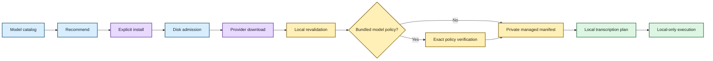

# Local model management 📦🔐

## The human version

Scholion needs speech models to transcribe locally. Those model files are large,
versioned execution dependencies, not mysterious cache confetti.

So Scholion keeps one deliberate boundary around them:

> **Downloading a model is an explicit action. Running transcription uses a model that
> Scholion has already installed, locally revalidated, and pinned to an immutable
> provider revision. When a release bundles Scholion's curated model policy, new
> transcription additionally requires the installed bytes to match that policy exactly.**

That gives ordinary users a simpler experience and gives maintainers something they can
actually reason about.



Application composition now loads a packaged `model-trust.json` from
`scholion.supply_chain` when one is present. A build that contains that reviewed catalog
automatically constructs `ModelManager` with policy enforcement enabled. A source or
development build with no packaged catalog retains the existing local/provider
revalidation path. There is no second runtime switch that can silently ship a catalog
while leaving it unenforced.

The repository still does **not** contain a production faster-whisper trust catalog. Real
entries must come from deliberate review of immutable upstream snapshots; tests use only
synthetic revisions and bytes.

## Why Scholion does not just trust whatever is in a cache

The Hugging Face cache is a useful byte-level storage layout. Scholion does not need to
copy model weights into a proprietary format.

But “some files exist in a cache directory” is not enough to answer:

- which model Scholion intended to install;
- which provider repository it came from;
- which immutable revision was resolved;
- whether the expected files are still present;
- whether those bytes match a Scholion-approved release policy; or
- whether a transcription plan can safely refer to that exact dependency later.

So the provider cache remains the physical home of the bytes while Scholion owns private
**managed manifests** describing snapshots it deliberately installed and locally
revalidated.

A pre-existing cache entry is not silently adopted as managed state.

## What a managed manifest records

The current contract records at least:

- logical model ID and engine;
- provider repository ID;
- requested provider revision, when supplied;
- resolved immutable revision;
- absolute local snapshot path;
- measured snapshot size; and
- local revalidation method.

A manifest can also record a separate policy-trust receipt when installation was
performed against a supplied curated Scholion trust catalog. That receipt contains the
catalog schema version, policy model identity and revision, exact-verification method,
verified file count, and verified byte count.

The manifest is a receipt and dependency record, not a second copy of the model. A
recorded policy receipt is also not a permanent trust bit: current policy verification is
recomputed when the managed state is read under a loaded trust catalog.

## The main responsibilities

`ModelCatalog` describes the finite set of models Scholion knows how to reason about.
For faster-whisper, quality/cache metadata is derived from the transcription strategy
catalog instead of duplicated.

`ModelManager` owns application-level inventory, explicit installation, manifest custody,
local revalidation, resolved-revision lookup, removal, and the boundary that applies
project-owned model policy when a curated catalog is supplied.

`ModelProvider` owns provider-specific mechanics such as obtaining a Hugging Face
snapshot, validating its cache layout, and removing an exact cached revision.

`ModelStorageAdmitter` checks disk capacity before acquisition starts.

`scholion.supply_chain` owns the stronger project policy itself: exact approved
repository/revision identity plus the full allowed file set, byte sizes, SHA-256 values,
source/license metadata, strict catalog loading, and fail-closed snapshot verification.

`AppContainer` owns composition. It loads the bundled catalog once and enables policy
enforcement whenever that catalog exists.

The split matters because “what models does Scholion support?”, “how does this provider
download bytes?”, “which exact bytes did the project approve?”, and “does this build
require that approval?” are different questions. Scholion composes those authorities
instead of collapsing provider-local validation and project policy into one vague
“verified” state.

## Install transaction without a bundled policy catalog

A source/development build with no reviewed bundled policy follows this order:

1. resolve the model ID through the catalog;
2. reject an invalid/blank requested revision;
3. admit the estimated cache requirement against current disk capacity;
4. create private model/cache/registry directories only after admission succeeds;
5. ask the provider to acquire the requested repository/revision;
6. reject a returned snapshot outside Scholion's configured model cache;
7. bind the snapshot path to the declared provider repository cache directory;
8. require the snapshot directory name to equal the resolved immutable revision;
9. require the provider-specific files to exist and be non-empty;
10. measure the installed snapshot and construct provenance; and
11. commit the private Scholion manifest **last**.

That ordering is intentional.

A disk refusal should not begin a giant download. A malformed provider result should not
become managed state. A manifest should mean “the install made it through the current
local validation contract,” not “we started trying.”

🦝 The raccoon gets a receipt after the groceries are actually in the pantry.

## Policy-enforced install transaction

When the current Scholion build contains a curated `ModelTrustCatalog`, `AppContainer`
enables the stricter transaction automatically:

1. resolve the ordinary model catalog entry and the matching project trust entry;
2. require model ID, engine, and provider repository identity to agree across both
   catalogs;
3. reject a caller-supplied revision that differs from the curated immutable revision
   **before** provider acquisition starts;
4. ask the provider for exactly the curated revision;
5. retain the normal provider/cache/repository validation boundary;
6. require the returned resolved revision to equal the curated revision;
7. require the observed snapshot file set to equal the curated file set exactly;
8. verify every curated file's byte size and SHA-256 while enforcing path/cache
   containment;
9. create separate policy-trust evidence from the successful exact verification; and
10. commit the managed manifest only after both local/provider validation and policy
    validation succeed.

With policy enforcement active, a missing catalog entry or a managed snapshot without
current policy evidence cannot be admitted to a **new transcription**.

This mechanism does not manufacture the production policy. The real faster-whisper
entries still require deliberate upstream review and must ship as part of a signed
Scholion release.

## Upgrading from a locally revalidated model to policy enforcement

Physical custody and execution admission are intentionally separate states.

When a release first introduces a bundled production policy, a model installed by an
older Scholion release can still be a valid locally managed snapshot without carrying
current policy evidence. That is a migration state, not a reason to either grandfather
untrusted bytes or lose custody of them.

In that state Scholion:

1. keeps the model visible as installed;
2. reports that it is not trusted by the current bundled policy;
3. refuses it for a new transcription because `resolved_revision()` is the
   execution-admission boundary under enforcement;
4. still allows explicit removal; and
5. offers a **Reinstall trusted copy** action through the normal curated install path.

A successful curated reinstall replaces the managed registration with exact current
policy evidence. This is fail-closed execution without a migration dead end.

## User surface

The normal flow remains deliberately boring. After the repository environment is
bootstrapped and activated:

```bash
scholion models recommend
scholion models install small
scholion transcribe recording.m4a
```

Inventory is offline:

```bash
scholion models
```

Removal is explicit:

```bash
scholion models remove small
```

The CLI requires confirmation unless `--yes` is supplied.

In the desktop, ordinary copy explains consequences rather than implementation: models
download only when the user chooses, stay on this computer in Scholion's private app
storage, and can be used offline after installation.

The Processing Center now carries three distinct facts:

- whether the current build enforces a bundled model policy;
- whether a model is physically installed; and
- whether that installed model currently satisfies the bundled policy.

A no-policy source build continues to describe the model as locally checked rather than
policy-trusted. A policy-enforced build can say that a model is trusted by **this
Scholion build** only after current exact verification succeeds. Legacy installed bytes
that lack that evidence are shown as needing a trusted reinstall.

Repository IDs, exact revisions, hashes, licenses, and detailed policy receipts remain
technical/security detail rather than ordinary consumer copy.

## Inventory and local revalidation

Inventory is offline and side-effect free. It does not create directories, download
models, or repair provider state.

When a managed manifest exists, Scholion revalidates its local custody before presenting
it as installed. Validation checks that:

- manifest identity still matches the catalog model/repository;
- the snapshot remains inside Scholion's configured model cache;
- the snapshot belongs to the declared provider repository cache directory;
- the path agrees with the recorded resolved revision;
- the local verification method is supported; and
- required provider files remain present/non-empty.

If the manager has a current trust catalog and the manifest carries policy-trust
evidence, it additionally recomputes the exact file-set/size/SHA-256 verification and
requires the resulting evidence to match the recorded receipt.

Inventory deliberately does **not** hide an otherwise valid legacy snapshot merely
because policy enforcement is now active. That snapshot remains visible/removable but is
reported with `policy_trusted=false`.

Execution admission is stricter. Under enforcement, `resolved_revision()` requires
current policy evidence and therefore rejects a legacy/untrusted manifest.

If external deletion or tampering makes managed state stale, Scholion fails closed. A
same-length byte mutation cannot preserve policy trust merely because the provider-local
required-file check still passes.

The receipt is evidence of what Scholion checked earlier. It is not allowed to become a
magic amulet that makes missing or modified bytes reappear.

## Local revalidation is not policy trust

Default faster-whisper revalidation establishes structural/provider provenance: expected
cache layout, repository/revision identity, and required non-empty files.

It does **not** by itself prove that every installed byte matches a project-approved
cryptographic allowlist. Do not describe that state simply as “verified” where a reader
could reasonably infer the stronger claim.

The stronger path is now integrated through installation, manifest custody, application
composition, new-transcription admission, Processing Center readiness, and migration UX.
The remaining model-side production task is release content: deliberately review real
upstream faster-whisper revisions, generate the exact curated catalog, include it in a
signed release, and qualify those pinned bytes on supported release platforms.

See **[Signed update and model trust channel](../security/update-model-trust.md)** for the
full trust model and privacy boundary.

## Transcription custody boundary

There is one ASR model path.

A new transcription plan resolves the selected faster-whisper model through the managed
registry.

In a build without a bundled production policy, that means the locally revalidated
managed revision. In a build with a bundled policy, the same lookup additionally requires
current Scholion policy trust. An installed-but-untrusted migration snapshot therefore
cannot be used to plan a new transcription.

A successful plan records a non-empty immutable resolved revision.

At execution time, faster-whisper loads that exact local revision with
`local_files_only=True`.

There is no:

- transcription-time ASR download flag;
- ambient-cache fallback;
- arbitrary configuration revision override; or
- silent substitution of a newer model because the old one is inconvenient.

Resume restores the exact managed model revision recorded in the checkpoint contract. It
never downloads a replacement as a side effect. Resume reproducibility remains distinct
from admitting a new job under a newer release policy.

## Network boundary 🔐

`scholion models install MODEL` is the explicit network-bearing ASR model action.

Inventory, recommendation, planning with an already-admissible managed model, and
execution do not need to contact the model provider.

Model management never uploads source media, transcripts, job metadata, or application
telemetry to the provider.

This is why the install boundary is visible to the user instead of being buried inside
`transcribe`.

## Removal transaction

Removal is intentionally asymmetric with installation:

1. resolve and locally validate the managed manifest;
2. reconstruct the exact installed snapshot identity;
3. ask the provider to remove that resolved revision from the local cache; and
4. delete the Scholion manifest **only after provider removal succeeds**.

Policy admission is not required merely to remove an old managed snapshot. That matters
for migration: an installed-but-untrusted model must remain removable.

If provider removal fails, the manifest is retained.

Scholion should not forget that it owns bytes it failed to remove.

## Failure semantics

Private registry/model state lives under Scholion's application model root.

These conditions fail closed:

- corrupt registry data;
- path escape;
- repository mismatch;
- stale/missing snapshot;
- unsupported local verification method;
- required-file verification failure;
- storage refusal; and
- provider removal failure.

With a trust catalog supplied, these conditions also fail closed before policy-trusted
registration or execution admission:

- missing required trust entry;
- catalog/model identity mismatch;
- moving or unapproved revision;
- undeclared or missing file;
- byte-size mismatch;
- SHA-256 mismatch; and
- persisted policy evidence that no longer matches current verification.

Routine public errors should describe the application failure without leaking private
internal paths.

## Reusing the custody pattern for future local models

Future model-backed capabilities should reuse the same ideas:

- capability-specific catalog/qualified profiles;
- provider adapters for acquisition;
- immutable resolved revisions;
- private manifests;
- disk admission before acquisition;
- offline inventory/revalidation;
- project-owned trust policy when executable/model bytes are distributed; and
- execution through managed, policy-qualified model identity where that policy exists.

The current FFmpeg speech-noise-suppression provider is model-free, so it does not
pretend to have a model manifest.

If a future neural enhancement, alignment, source-separation, or embedding provider adds
weights, those weights should enter through this custody/trust family rather than
inventing a new hidden download path.

## Generalize only when reality asks

The first implementation manages faster-whisper models. Semantic embeddings currently
have their own strict-local profile/snapshot boundary and are not yet a locked managed
extra.

A broader shared model-custody abstraction should emerge when a second qualified
model-backed capability exposes real common variation.

Scholion does not need a speculative universal model marketplace merely because such an
abstraction would look impressive on a diagram.

## Current deliberate limits

Model management does not currently provide:

- automatic/background model updates;
- adoption of arbitrary cache entries;
- generic arbitrary model hubs;
- model quota/garbage-collection policy;
- hosted inventory/telemetry; or
- a reviewed production faster-whisper policy catalog bundled into application releases.

The last item is intentionally not represented by placeholder hashes. A release becomes
policy-enforced only when reviewed trust content is actually packaged.

The stable rule is:

> **Scholion should know which local model dependency it chose, where it came from,
> which immutable revision it installed, what level of trust/revalidation has actually
> been established, whether it is still present, and when it is safe to use or remove.**

Not glamorous. Extremely useful. 💃
