# Local model management 📦🔐

## The human version

Scholion needs speech models to transcribe locally. Those model files are large,
versioned execution dependencies, not mysterious cache confetti.

So Scholion keeps one very deliberate boundary around them:

> **Downloading a model is an explicit action. Running transcription uses a model that
> Scholion has already installed, locally revalidated, and pinned to an immutable
> provider revision.**

That gives ordinary users a simpler experience and gives maintainers something they can
actually reason about.

```mermaid
flowchart LR
    A[Model catalog] --> B[Recommend]
    B --> C[Explicit install]
    C --> D[Disk admission]
    D --> E[Provider download]
    E --> F[Local revalidation]
    F --> G[Private managed manifest]
    G --> H[Local transcription plan]
    H --> I[Local-only execution]

    classDef info fill:#D8EEFF,stroke:#2E617B,stroke-width:2px,color:#12222A
    classDef network fill:#E8D9FF,stroke:#68469B,stroke-width:2px,color:#1F1630
    classDef evidence fill:#FFF0B8,stroke:#8A6B18,stroke-width:2px,color:#2C260F
    classDef run fill:#DDF5E3,stroke:#347A46,stroke-width:2px,color:#142719

    class A,B,D info
    class C,E network
    class F,G evidence
    class H,I run
```



## Why Scholion does not just trust whatever is in a cache

The Hugging Face cache is a useful byte-level storage layout. Scholion does not need to
copy model weights into a proprietary format.

But “some files exist in a cache directory” is not enough to answer:

- which model Scholion intended to install;
- which provider repository it came from;
- which immutable revision was resolved;
- whether the expected files are still present; or
- whether a transcription plan can safely refer to that exact dependency later.

So the provider cache remains the physical home of the bytes while Scholion owns private
**managed manifests** describing snapshots it deliberately installed and locally
revalidated.

A pre-existing cache entry is not silently adopted as managed state.

## What a managed manifest records

The current contract records at least:

- logical model ID and engine;
- provider repository ID;
- requested provider revision, when supplied;
- resolved immutable revision;
- absolute local snapshot path;
- measured snapshot size; and
- local revalidation method.

The manifest is a receipt and dependency record, not a second copy of the model.

## The three main responsibilities

`ModelCatalog` describes the finite set of models Scholion knows how to reason about.
For faster-whisper, quality/cache metadata is derived from the transcription strategy
catalog instead of duplicated.

`ModelManager` owns application-level inventory, explicit installation, manifest custody,
local revalidation, resolved-revision lookup, and removal.

`ModelProvider` owns provider-specific mechanics such as obtaining a Hugging Face
snapshot, validating its cache layout, and removing an exact cached revision.

`ModelStorageAdmitter` checks disk capacity before acquisition starts.

The split matters because “what models does Scholion support?” and “how does this
provider download bytes?” are different questions.

The separate `scholion.supply_chain` trust layer introduced under issue #110 defines a
stronger project-owned policy: exact approved repository/revision identity plus the full
allowed file set, byte sizes, SHA-256 values, source/license metadata, and fail-closed
snapshot verification. That stronger policy is intentionally distinct from today's
provider-layout revalidation until it is wired into production model installation.

## Install transaction today

A model install currently follows this order:

1. resolve the model ID through the catalog;
2. reject an invalid/blank requested revision;
3. admit the estimated cache requirement against current disk capacity;
4. create private model/cache/registry directories only after admission succeeds;
5. ask the provider to acquire the requested repository/revision;
6. reject a returned snapshot outside Scholion's configured model cache;
7. bind the snapshot path to the declared provider repository cache directory;
8. require the snapshot directory name to equal the resolved immutable revision;
9. require the provider-specific files to exist and be non-empty;
10. measure the installed snapshot and construct provenance; and
11. commit the private Scholion manifest **last**.

That ordering is intentional.

A disk refusal should not begin a giant download. A malformed provider result should not
become managed state. A manifest should mean “the install made it through the current
local validation contract,” not “we started trying.”

🦝 The raccoon gets a receipt after the groceries are actually in the pantry.

When #110's production policy integration lands, acquisition must request the curated
immutable revision and the exact file set, sizes, and SHA-256 values must match the
bundled trust entry **before** the model can be registered as policy-trusted/ready.

## User surface

The normal flow is deliberately boring. After the repository environment is bootstrapped
and activated:

```bash
scholion models recommend
scholion models install small
scholion transcribe recording.m4a
```

Inventory is offline:

```bash
scholion models
```

Removal is explicit:

```bash
scholion models remove small
```

The CLI requires confirmation unless `--yes` is supplied.

In the desktop, ordinary copy should explain consequences rather than implementation:
models download only when the user chooses, stay on this computer in Scholion's private
app storage, and can be used offline after installation. Repository IDs, exact revisions,
hashes, licenses, and policy-trust evidence belong under technical details or security
documentation.

## Inventory and local revalidation

Inventory and resolved-revision lookup are offline and side-effect free. They do not
create directories, download models, or repair provider state.

When a managed manifest exists, Scholion revalidates it before claiming the model is
usable under the current custody contract. Validation checks that:

- manifest identity still matches the catalog model/repository;
- the snapshot remains inside Scholion's configured model cache;
- the snapshot belongs to the declared provider repository cache directory;
- the path agrees with the recorded resolved revision;
- the local verification method is supported; and
- required provider files remain present/non-empty.

If external deletion or tampering makes that managed state stale, Scholion fails closed.

The receipt is evidence of what Scholion checked earlier. It is not allowed to become a
magic amulet that makes missing bytes reappear.

## Local revalidation is not policy trust

Current faster-whisper revalidation establishes structural/provider provenance: expected
cache layout, repository/revision identity, and required non-empty files.

It does **not** yet prove that every installed byte matches a project-approved
cryptographic allowlist. Do not describe the current state simply as “verified” where a
reader could reasonably infer that stronger claim.

The #110 foundation now provides the stronger primitives: a curated immutable model
policy and exact file-set/size/SHA-256 verification. The remaining production work is to
review real upstream faster-whisper revisions, ship those curated entries inside a signed
Scholion release, make provider acquisition request only the approved revision, require
full trust verification before registration, and record policy identity in the local
manifest.

See **[Signed update and model trust channel](../security/update-model-trust.md)** for the
full trust model and privacy boundary.

## Transcription custody boundary

There is one ASR model path.

A new transcription plan must resolve the selected faster-whisper model through the
locally revalidated managed registry.

If the model is not installed and locally revalidated, planning fails with an
install-first message.

A successful plan therefore records a non-empty immutable resolved revision.

At execution time, faster-whisper loads that exact local revision with
`local_files_only=True`.

There is no:

- transcription-time ASR download flag;
- ambient-cache fallback;
- arbitrary configuration revision override; or
- silent substitution of a newer model because the old one is inconvenient.

Resume restores the exact managed model revision recorded in the checkpoint contract.
It never downloads a replacement as a side effect.

After #110 integration, “usable for a new transcription” additionally requires current
Scholion policy trust, not merely the older structural/provider receipt.

## Network boundary 🔐

`scholion models install MODEL` is the explicit network-bearing ASR model action.

Inventory, recommendation, planning with an already-managed model, and execution do not
need to contact the model provider.

Model management never uploads source media, transcripts, job metadata, or application
telemetry to the provider.

This is why the install boundary is visible to the user instead of being buried inside
`transcribe`.

## Removal transaction

Removal is intentionally asymmetric with installation:

1. resolve and validate the managed manifest;
2. reconstruct the exact installed snapshot identity;
3. ask the provider to remove that resolved revision from the local cache; and
4. delete the Scholion manifest **only after provider removal succeeds**.

If provider removal fails, the manifest is retained.

Scholion should not forget that it owns bytes it failed to remove.

## Failure semantics

Private registry/model state lives under Scholion's application model root.

These conditions fail closed:

- corrupt registry data;
- path escape;
- repository mismatch;
- stale/missing snapshot;
- unsupported local verification method;
- required-file verification failure;
- storage refusal; and
- provider removal failure.

Once policy trust is wired into installation, a missing trust entry, moving/unapproved
revision, undeclared file, size mismatch, or SHA-256 mismatch must also fail closed before
the snapshot can be registered as policy-trusted.

Routine public errors should describe the application failure without leaking private
internal paths.

## Reusing the custody pattern for future local models

Future model-backed capabilities should reuse the same ideas:

- capability-specific catalog/qualified profiles;
- provider adapters for acquisition;
- immutable resolved revisions;
- private manifests;
- disk admission before acquisition;
- offline inventory/revalidation;
- project-owned trust policy when executable/model bytes are distributed; and
- execution through managed, policy-qualified model identity where that policy exists.

The current FFmpeg speech-noise-suppression provider is model-free, so it does not
pretend to have a model manifest.

If a future neural enhancement, alignment, source-separation, or embedding provider adds
weights, those weights should enter through this custody/trust family rather than
inventing a new hidden download path.

## Generalize only when reality asks

The first implementation manages faster-whisper models. Semantic embeddings currently
have their own strict-local profile/snapshot boundary and are not yet a locked managed
extra.

A broader shared model-custody abstraction should emerge when a second qualified
model-backed capability exposes real common variation.

Scholion does not need a speculative universal model marketplace merely because such an
abstraction would look impressive on a diagram.

## Current deliberate limits

Model management does not currently provide:

- automatic/background model updates;
- adoption of arbitrary cache entries;
- generic arbitrary model hubs;
- model quota/garbage-collection policy;
- hosted inventory/telemetry; or
- production wiring from the #110 curated trust policy into faster-whisper install,
  revalidation, inventory, and execution admission.

The stable rule is:

> **Scholion should know which local model dependency it chose, where it came from,
> which immutable revision it installed, what level of trust/revalidation has actually
> been established, whether it is still present, and when it is safe to use or remove.**

Not glamorous. Extremely useful. 💃