# Processing capabilities 🎛️

Status: local transcription, canonical evidence, lexical/semantic retrieval, verified
navigation, durable research state, incremental refresh, remembered locations, and first
Tauri/React import/Library/evidence-reader presentation are implemented. A dedicated
Research desktop workspace is next.  
Last updated: August 19, 2026

Scholion is not one giant transcription function. It composes small local capabilities
into a reproducible workflow whose source, execution choices, recovery state, transcript,
search projections, navigation views, research state, and desktop presentation remain
explainable afterward.

## What the user experiences now

1. choose a recording or remembered location;
2. inspect source and current machine;
3. install a recommended model explicitly if needed;
4. transcribe locally and resume if interrupted;
5. publish canonical JSON plus optional derived views;
6. refresh/search the private library;
7. follow a result back to verified canonical evidence;
8. keep durable notes/tags/collections/saved searches attached to that evidence; and
9. use native import, Library discovery, and the verified evidence reader in the desktop shell.

The next product layer is a dedicated Research workspace, then advanced Library controls
and Tauri-owned media playback.



[Diagram source (Mermaid)](../diagrams/src/processing-capabilities.mmd)

Text fallback: local execution produces canonical transcript evidence; rebuildable search
ranks it; verified navigation resolves results; authoritative research state attaches to
exact evidence and can constrain later retrieval; the current desktop consumes import,
Library, and evidence-reader seams, with Research next.

## 1. Media and runtime inspection

`FfprobeMediaProbe` owns source facts, fingerprints the complete source, reads bounded
stream/container metadata with file-only protocol access, and refuses a source whose
identity changes during inspection.

`RunnerInspector`, `HardwareTopologyInspector`, `EngineCapabilityRegistry`, and
`StrategyEvaluator` keep process-visible resources, physical accelerator evidence,
runtime capability, and strategy admission separate. A visible GPU is not assumed usable.

## 2. Model custody

A strategy is not executable until its selected faster-whisper model has a verified
managed immutable revision. `ModelManager` owns explicit acquisition/custody; execution
uses the already-recorded local revision. No transcription-time ASR download fallback
exists.

## 3. Canonical audio and enhancement

The current canonical processing format is WAV / `pcm_s16le` / 16 kHz / mono.
Already-canonical WAV may use `DIRECT`; other supported audio-bearing media uses
`FFMPEG_NORMALIZE`.

Optional enhancement creates private derived audio and must not change timeline shape.
The original recording remains authoritative.

## 4. Segmentation, word timing, and checkpoints

Scholion owns deterministic PCM-frame work windows, stable work IDs, one job-scoped ASR
session, ordered checkpoints, and source-relative rebasing of native word timing.

Resume restores the source/model/device/decode/enhancement/segmentation/alignment contract
and re-admits current resources rather than silently changing execution semantics.

## 5. Language and speaker evidence

Multilingual decoding can reconsider language within durable work units. Local language
attribution may leave ambiguous text unlabeled.

Diarization is recording-scoped speaker evidence, not identity. Word timing allows
conservative attribution inside mixed-speaker segments; ambiguous overlap remains
unattributed. User display labels stay separate from anonymous canonical refs.

## 6. Canonical transcript and derived exports

Canonical JSON is authoritative transcript evidence. It records source/stream provenance,
execution identity, managed model revision, source-relative segment/word timing, language,
optional enhancement provenance, source-declared temporal tags, and optional diarization.

TXT, SRT, and WebVTT are deterministic publication views, not recognition truth.

## 7. Retrieval and verified navigation 🦝

Canonical JSON is projected into rebuildable lexical/semantic search state.
`TranscriptSearch` composes lexical BM25, optional semantic exact-scan retrieval, and hybrid
RRF while preserving rank provenance.

`EvidenceLocator` re-verifies canonical generation identity before exposing precise
segments, justified aligned-word matches, context, and deterministic `seek_seconds`.
The desktop Evidence reader consumes the path-minimized result DTO and can move a verified
cursor among canonical timed words. Media playback remains separate.

## 8. Durable research workspace

Notes, tags, collections, evidence anchors, and saved searches are authoritative SQLite
user state. `ResearchStateProjector` builds a disposable DuckDB research projection.
`ResearchWorkspaceService` composes research state with verified evidence and transcript
retrieval.

Research constraints resolve to canonical evidence scope **before** BM25 or semantic
scoring. A changed canonical generation does not silently reattach an older note.

## 9. Incremental refresh and remembered locations

Normal corpus growth uses incremental refresh; full rebuild remains repair/recovery.
`LibraryLocationService` owns one-time-versus-remembered folder semantics. Transcript roots
participate in canonical reconciliation; recording roots only perform cheap candidate
discovery. Discovery does not itself hash, FFprobe, copy, or transcribe media.

The current desktop intake screen consumes this service through native Tauri dialogs and
the versioned bridge.

## 10. Desktop presentation boundary

```text
React + TypeScript + Vite   presentation
Tauri / Rust                native capability host
Python Scholion             application/evidence authority
```

The bridge exposes only allowlisted operations. React does not own SQL, DuckDB/SQLite,
arbitrary shell execution, or raw canonical/source path authority for evidence views.

Current desktop surfaces are **Add evidence**, **Library**, and the verified **Evidence
reader/cursor**. Archive/Midnight themes and Playwright/axe checks are part of the same
product contract. **Research** is the next dedicated workspace.

## 11. Private storage and observability

Structured logging uses Structlog behind `ILogger`; routine logs redact local paths by
default. Private execution material, model caches, search databases, authoritative SQLite
research state, rebuildable projections, and user-visible transcript artifacts remain
distinct.

POSIX private state uses owner-only mode policy; Windows uses current-user DACL policy.
These are filesystem access controls, not application encryption or secure erasure.

## Capability ownership map

| Capability | Owns | Does not own |
|---|---|---|
| `FfprobeMediaProbe` | source identity + stream metadata | transcoding |
| `StrategyEvaluator` | safe strategy admission/ranking | model acquisition |
| `ModelManager` | managed model custody/revision | ASR execution |
| `TranscriptionJobPlanner` | immutable execution plan | performing work |
| `FfmpegAudioDecoder` | selected-stream canonicalization | enhancement |
| `FfmpegAfftdnEnhancer` | optional noise suppression | source authority |
| `FasterWhisperSession` | local ASR + native word timing | model download |
| `LocalCheckpointStore` | private resumable evidence | public artifacts |
| `TranscriptAssembler` | source-relative transcript assembly | filesystem policy |
| `SpeakerDiarizer` | anonymous speaker-turn evidence | biometric identity |
| `TranscriptExporter` | derived TXT/SRT/VTT | recognition truth |
| `DuckDbTranscriptIndex` | private BM25 projection | canonical truth |
| `DuckDbSemanticIndex` | rebuildable vectors + exact similarity | canonical evidence |
| `TranscriptSearch` | retrieval composition + RRF | storage implementation |
| `TranscriptLibraryService` | refresh/rebuild/retrieval/integrity | research authority |
| `LibraryLocationService` | remembered roots + cheap discovery | ASR execution/source deletion |
| `EvidenceLocator` | verified canonical coordinates | ranking |
| `ResearchStateStore` | durable notes/tags/collections/anchors | search ranking |
| `WorkspaceMetadataStore` | saved-search intent + derived navigation | transcript authority |
| `ResearchStateProjector` | deterministic projection convergence | user truth |
| `ResearchWorkspaceService` | research + evidence + retrieval application seam | database topology leakage |
| `desktop.bridge` | versioned allowlisted desktop IPC | business-rule ownership |
| React frontend | accessible interaction/presentation | DB/filesystem/shell authority |
| Tauri host | native dialogs/process/native capability boundary | research/search policy |

## Current deliberate limits

Scholion does not currently claim calibrated performance across representative consumer
hardware, arbitrary alternate ASR engines, forced alignment, biometric speaker identity,
source separation, generative restoration, trusted SMPTE mapping, secure erasure, a normal
packaged semantic dependency path, ANN/HNSW, generated corpus answers, selected/citable
result-set objects, automatic cross-generation note re-anchoring, a dedicated Research
desktop workspace, local audio/video playback, or a polished signed installer/update
lifecycle.

## What is the next product layer?

1. **Research workspace UI** over existing note/tag/collection/saved-search authority.
2. **Advanced Library controls** over the typed `SearchQuery` contract.
3. **Tauri-owned local media playback** driven by verified source-relative coordinates.
4. **Desktop packaging/first-run/update/uninstall** plus backup/restore/export.
5. **Semantic-install and representative-device release qualification**.

> **Source evidence stays authoritative. Derived machinery stays explainable. User
> knowledge does not get mistaken for cache.**
