# Word-level timestamp alignment 🕰️

A transcript that says *what* somebody said is useful. A transcript that can also point
to **when each word occurred** is much more useful for speaker handoffs, search
highlighting, source seeking, precise annotations, and later editing interfaces.

Scholion preserves word timing evidence already produced by faster-whisper. It does not
invent timestamps from character positions, and it does not currently run a separate
forced-alignment model.

> **The rule:** preserve the engine's word evidence, put it on the same source-relative
> timeline as the canonical transcript, and stay conservative when that evidence is
> ambiguous.

🦝 “More precise coordinates” does not mean “permission to become more confident than
the evidence.”

## What changes for a user?

Usually, nothing about the transcription command.

Word timing is part of the current faster-whisper execution/checkpoint contract. A normal
local transcription can produce canonical evidence shaped conceptually like:

```text
segment  12.40s ─ 15.10s   "we moved the meeting to Friday"

word     12.40s ─ 12.70s   " we"
word     12.70s ─ 13.20s   " moved"
word     13.20s ─ 13.55s   " the"
word     13.55s ─ 14.20s   " meeting"
word     14.20s ─ 14.45s   " to"
word     14.45s ─ 15.10s   " Friday"
```

Exact engine token text is retained, including meaningful leading whitespace.
Presentation may trim/style later; canonical evidence does not rewrite it for aesthetics.

## The timeline stays the same

Scholion owns deterministic work windows over canonical decoded audio. Faster-whisper
returns timestamps relative to one work window. Assembly rebases both segment and word
intervals onto one source-relative timeline.


[Diagram source (Mermaid)](../diagrams/src/word-alignment-timeline.mmd)

If work window 7 begins at source second `4200` and the engine reports a word at `21.70`,
the canonical word starts at `4221.70`.

Segmentation is an execution detail. It does not reset published word time every ten
minutes.

## Evidence model

`AlignedWord` is a frozen/slotted value containing:

- `start_seconds`;
- `end_seconds`;
- exact engine token text;
- optional engine word probability; and
- optional anonymous `speaker_ref` after diarization projection.

`AlignedRecognizedSegment` retains the segment contract and adds an ordered `words`
tuple.

Validation requires finite/non-negative ordered time, segment containment within a small
boundary tolerance, ordered non-overlapping word intervals beyond that tolerance,
probability within zero-to-one when present, and non-blank word evidence.

The tolerance handles small floating-point/engine boundary differences. It changes
**validation**, not stored timestamps. Scholion does not nudge timestamps onto a prettier
grid.

## Is this forced alignment?

No.

A forced aligner usually takes known text plus audio and performs a separate acoustic
alignment pass. Scholion asks faster-whisper for its native word timing and preserves it.

That avoids another model/download and another heavy inference pass, while keeping timing
attributable to the same managed ASR execution that produced the text.

It also means Scholion should not advertise native word timing as independently corrected
forced-alignment truth.

## Speaker handoffs get much better 💃

ASR segments and diarization turns have different boundaries. Word intervals let Scholion
project anonymous turns onto smaller evidence coordinates.

A word receives a speaker only when exactly one diarized speaker overlaps that word
interval. The enclosing segment keeps a convenience speaker only when the aligned words
support one uniform speaker.

Mixed handoffs and ambiguous overlap therefore remain explicit.



[Diagram source (Mermaid)](../diagrams/src/speaker-handoffs.mmd)

Scholion now also has a derived speaker transcript that presents clean handoffs, true
simultaneous overlap, sequential mixed/unresolved text, and unattributed text separately.
User-assigned names such as `Dr. Chen (speaker-02)` remain durable presentation state over
anonymous evidence, not replacements for it.

Alignment alone still does not separate simultaneous speech into independent audio
sources.

## Checkpoint and resume semantics

Alignment changes recognized evidence, so it belongs in the private checkpoint contract.

New manifests record:

```text
schema_version   = 1
provider         = faster-whisper
word_timestamps  = true
```

Per-window checkpoint payloads persist aligned words. Resume restores that evidence before
source-relative assembly. A checkpoint lacking the current alignment contract is refused
rather than being mixed with newly aligned work.

## What happens to search?

Ranking still indexes canonical **segment text once**. Nested words do not become one
search document per token.

What changed later is the presentation/navigation consumer.

After lexical/semantic/hybrid retrieval ranks a passage, `EvidenceLocator` can verify the
exact canonical transcript and resolve the result back onto segment and word evidence:

- lexical results may highlight matching aligned words;
- exact phrase highlights require contiguous canonical word tokens;
- semantic-only results receive passage navigation but no invented exact-word match;
- neighboring canonical context may be added after ranking; and
- the first justified aligned match can become a source seek coordinate.

So alignment enriches navigation **without changing ranking semantics**.

See **[Evidence-first corpus search](corpus-search.md)** and
**[From search result to the exact evidence](../evidence-navigation.md)**.

## What else word coordinates now support

The implemented consumers include:

- finer anonymous speaker handoffs;
- overlap-aware speaker presentation;
- human source-relative time display;
- exact lexical result highlighting; and
- deterministic search-result seek coordinates.

The same coordinates are ready to support later:

- durable note/tag/annotation anchors;
- graphical click-to-media playback;
- subtitle/caption editing; and
- comparison with a future independently qualified forced-alignment provider.

Those consumers should use actual canonical timing evidence rather than derive fake word
positions from character counts.

## What this does **not** claim

Word alignment does not provide:

- independent forced alignment;
- phoneme-level timestamps;
- fabricated character offsets;
- calibrated word probability as a universal confidence score;
- automatic text correction from timing evidence;
- speech/source separation for simultaneous speakers; or
- biometric/cross-recording speaker identity.

Original-media temporal provenance, user display labels, overlap presentation, and
aligned search navigation are now separate implemented layers above the word-coordinate
foundation.

🧜‍♀️ One timeline at a time. The mermaid has seen what happens when clocks are allowed
to breed unsupervised.
