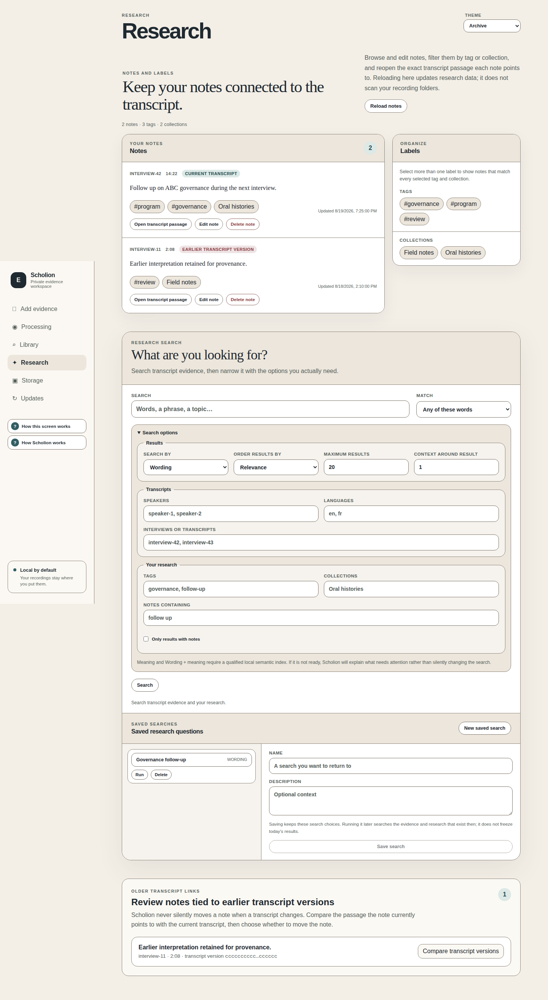
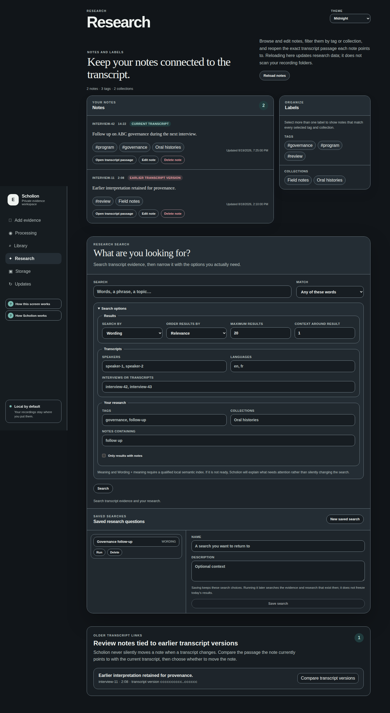
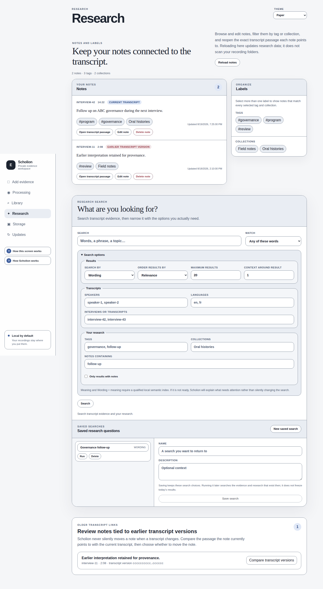
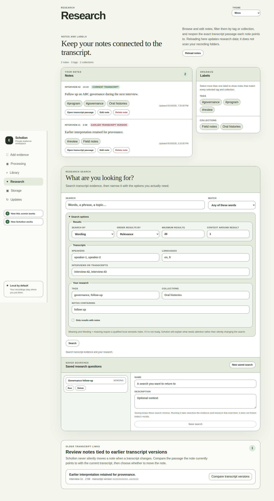
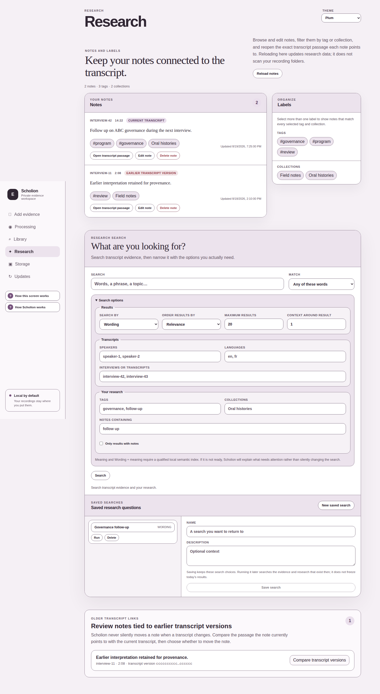
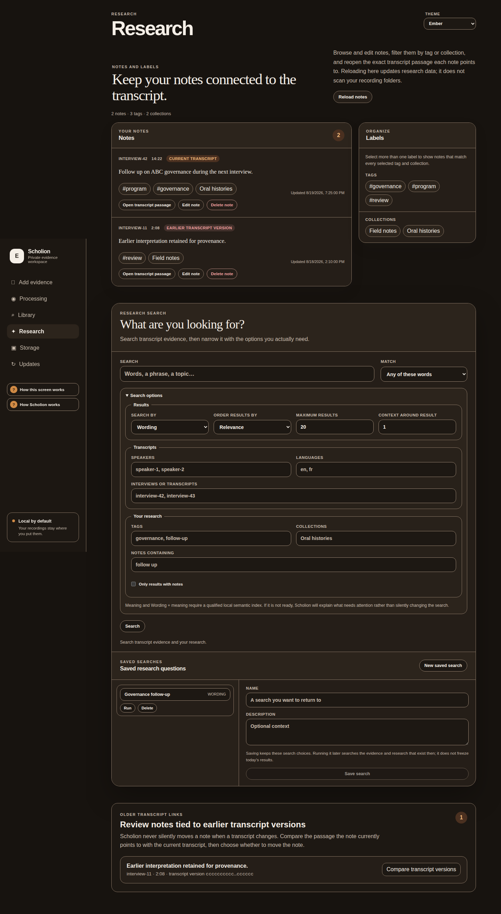
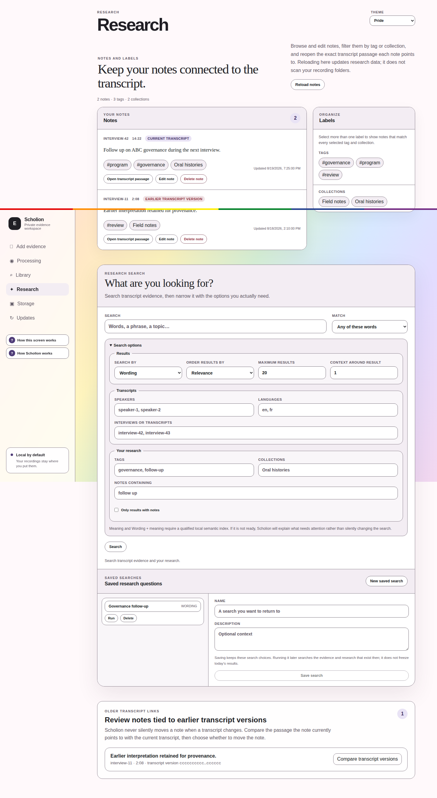
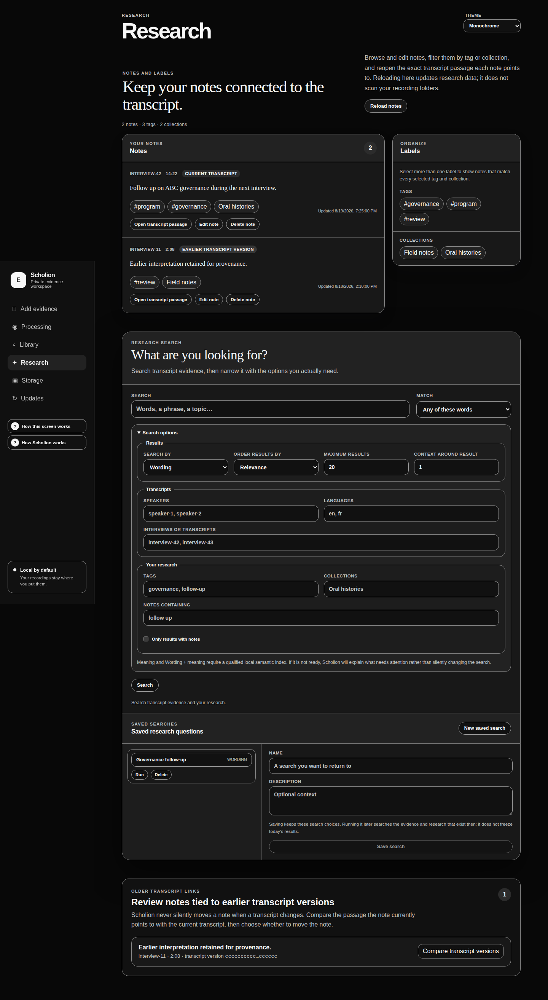

# Desktop themes and accessibility

Scholion themes are presentation, not application state. A skin may change color and visual tone; it may not change evidence, research, processing, playback authorization, or what an interaction means.

## One semantic token contract

Every desktop skin supplies the same semantic CSS roles:

| Token | Meaning |
|---|---|
| `--bg` | application background |
| `--surface`, `--surface-raised`, `--surface-soft` | content surfaces at increasing visual emphasis |
| `--ink`, `--muted` | primary and secondary text |
| `--border` | general structural boundary |
| `--accent`, `--accent-strong`, `--accent-soft`, `--on-accent` | interactive emphasis and readable foreground |
| `--control-bg`, `--control-ink`, `--control-border` | native and custom form controls |
| `--focus` | keyboard focus indicator |
| `--danger` | destructive/error text role |
| `--selection-bg`, `--selection-ink` | selected text |

The six original palettes live in `frontend/src/styles.css`; additive product skins may live in a dedicated palette sheet such as `theme-extras.css`, but they still implement exactly this contract. Components consume semantic meanings. They do not own theme-specific whites, grays, blues, or dark-mode exceptions.

The registry in `frontend/src/themes.ts` is the only source for supported IDs, labels, and browser light/dark scheme. CSS owns values. That keeps the theme menu, component code, and palettes from becoming competing registries.

## Current skins

Scholion ships eight skins through one compact **Theme** picker:

- **Archive**: warm paper neutrals with restrained teal;
- **Midnight**: charcoal surfaces with cool teal;
- **Paper**: cool neutral paper with ink blue;
- **Moss**: soft mineral greens;
- **Plum**: muted aubergine on warm pale surfaces;
- **Ember**: warm near-black surfaces with amber emphasis;
- **Pride**: a high-contrast plum/paper interface with a decorative rainbow edge; and
- **Monochrome**: deliberately grayscale near-black surfaces with white interaction emphasis.

Pride's rainbow is decoration only. Status, selection, errors, readiness, speaker overlap, playback state, and destructive actions remain understandable without it. Monochrome is not merely another blue-black dark theme: all semantic color tokens are grayscale, which is separately asserted in browser tests.

Theme choice is browser-local presentation preference. Failure to read or write it falls back to Archive and must never block the evidence workspace.

## Rendered theme gallery

These screenshots are generated from the real browser development shell, at a fixed desktop viewport, using the same `THEMES` registry that drives the product picker. Each capture opens **Research** and expands **Search options** so the gallery includes ordinary surfaces, navigation, text, buttons, and a native select control rather than an empty color swatch.

| Archive | Midnight |
|---|---|
|  |  |
| Paper | Moss |
|  |  |
| Plum | Ember |
|  |  |
| Pride | Monochrome |
|  |  |

The gallery is documentation, not a pixel-golden correctness test. Browser/font rendering can legitimately move while the semantic contract remains correct. Contrast, accessible naming, control behavior, and axe checks remain the actual CI invariants.

To regenerate the checked-in gallery after an intentional visual/theme change:

```bash
cd frontend
npm ci
npx playwright install chromium
npm run docs:theme-gallery
```

`frontend/playwright.gallery.config.ts` keeps this capture lane separate from ordinary Playwright test discovery. `frontend/gallery/theme-gallery.spec.ts` iterates `THEMES`, so a newly registered skin automatically becomes part of the capture set without maintaining a second list of theme IDs. Review regenerated images as documentation changes before committing them.

## Contrast is a product invariant

`frontend/tests/theme-accessibility.spec.ts` iterates the registry, so a newly registered skin automatically enters the same qualification matrix. It checks:

- ordinary text pairs at **4.5:1 or greater**;
- control boundaries and focus indicators at **3:1 or greater**;
- accent buttons through `--on-accent` rather than an assumed white foreground;
- selection foreground/background;
- declared browser `color-scheme`;
- actual Research native controls; and
- axe against the rendered page.

Do not tune a palette to a screenshot and then add exceptions until it passes. If the semantic pairs fail, fix the palette.

## Native controls are part of the skin

Inputs, selects, textareas, checkboxes, radios, options, placeholders, disabled states, selection, and focus are normalized centrally. Every theme declares `color-scheme`, so browser/OS controls receive the correct native light/dark context.

The verified playback surface also deliberately uses native `<audio>`/`<video>` controls rather than rebuilding transport widgets in React. Playback never autoplays after verification. The separate **Prepare playback** and **Play from evidence cursor** actions remain ordinary keyboard-reachable buttons, status/error messages use semantic roles, and surrounding presentation honors `prefers-reduced-motion`.

Do not fix contrast with a component-local `#666`, `#fff`, or platform gray. Fix the semantic role. The same repair should work in Intake, Processing, Library, Research, transcript tools, playback, and in-app help.

Browser automation cannot fully prove how opened native menus or media controls are painted by every Windows/macOS/Linux stack. Representative-device qualification still includes opened controls, media transport, forced/high-contrast modes, scaling, keyboard traversal, and platform focus treatment.

## Help must work without hover

Scholion's in-app guidance is progressive disclosure, not a collection of mouse-only tooltips.

The reusable `InfoPopover` contract requires:

- an ordinary focusable button with a visible text label;
- programmatic expanded state through `aria-expanded` and `aria-controls`;
- pointer, touch, and keyboard activation;
- **Escape** to close an open panel;
- focus restoration to the trigger after Escape or the explicit close action;
- an explicit close control inside the panel;
- semantic-token styling rather than theme-specific colors; and
- a narrow-screen layout that remains reachable without hover.

Sidebar help stays available after first use, while Evidence reader, Playback, and Transcript tools add local explanations at the point of use. A user should never have to remember what a one-time onboarding tour said three months ago.

Help copy is also subject to the architecture boundary: it may describe a backend rule, but it may not recreate or enforce that rule in React. See **[In-app guidance](../in-app-guidance.md)**.

## Color cannot be the only signal

Status, errors, selection, processing readiness, current/older evidence, speaker overlap, playback verification/failure, help expanded state, disabled actions, and destructive scope all require text or semantic structure in addition to color. The transcript-tools overlap view, for example, says **Overlap** and lists both evidence refs; border treatment is secondary decoration. Playback similarly reports missing, changed, ambiguous-track, and decoder states in text rather than relying on media-control appearance.

## Adding a skin

A new skin is acceptable only when it:

1. is registered once in `themes.ts`;
2. supplies the complete semantic token contract;
3. declares an explicit light or dark `color-scheme`;
4. passes the shared contrast matrix and axe checks;
5. does not add component-specific palette overrides;
6. remains legible for focused, selected, disabled, error, help, and native-control states; and
7. does not use color as the only carrier of product meaning.

This is intentionally more restrictive than “the screenshot looks good.” Unreadable UI should be difficult to commit.
