# Semantic retrieval qualification 🧪🔎

Transcript Library V2 is full of small decisions that can quietly make search wrong
while the happy path still looks fine.

Chunk boundaries can drop evidence. Filters can be applied too late. A stale vector
space can look plausible. One malformed embedding can poison a rebuild. Hybrid ranking
can claim provenance it did not actually earn.

So the qualification question is not “did we write a lot of tests?”

It is:

> **If one of these decisions were subtly wrong, would a specific test notice?**

## Qualification matrix

| Test style | What it protects | Current examples |
|---|---|---|
| Positive | intended retrieval behavior | deterministic chunks, exact vector ranking, RRF fusion |
| Negative | fail-closed behavior | stale corpus, missing model, malformed vectors, embedding failure |
| Boundary | thresholds and invalid contracts | chunk target/max sizes, indivisible oversized source segments |
| Property-based | invariants over many generated cases | every canonical segment appears exactly once in deterministic chunks |
| Integration | cross-component behavior | canonical JSON → projection → vectors → DuckDB → hybrid search |
| Mutation | strength of decision tests | targeted Poodle workflow over semantic/retrieval/service modules |

The different styles are complementary. Property tests do not make named boundary tests
obsolete. Mutation testing does not make ordinary negative tests optional.

## Why there is no Factory Boy here

The semantic tests mostly construct small immutable domain values, not sprawling ORM
object graphs with lifecycle hooks.

Narrow builders and Hypothesis strategies give the useful construction behavior without
another dependency.

If object construction later becomes genuinely lifecycle-heavy, revisit the decision.
Do not add a factory framework merely because test data exists.

🦝 The raccoon is perfectly capable of constructing a frozen dataclass by hand.

## Hypothesis: protect segment custody, not only examples

`src/scholion/library/tests/test_semantic.py` generates varied segment word counts and
chunking thresholds and protects invariants such as:

- same input/profile → same chunks and IDs;
- every canonical segment appears **exactly once** in the flattened chunk sequence;
- no chunk invents, duplicates, or drops an evidence coordinate;
- chunk timestamps come from the first/last canonical source segments; and
- exceeding `max_words` is permitted only when one indivisible source segment is itself
  larger than that maximum.

Named cases still call out important boundaries such as:

```text
target_words = 0                  → invalid
max_words < target_words          → invalid
one source segment > max_words    → remains indivisible
```

A future maintainer should not have to reverse-engineer a Hypothesis strategy to learn
which boundary is load-bearing.

## Embedding-provider defensive checks

The qualified E5 adapter should reject at least:

- unavailable local snapshot directory;
- snapshot/revision mismatch;
- blank input text;
- wrong number of output vectors;
- wrong vector dimensions;
- non-finite values such as NaN/Infinity; and
- vectors that violate the declared L2-normalized profile contract.

The runtime is faked for these unit tests.

Qualification should not require downloading a model or sending text anywhere.

## Failure preservation: a bad rebuild must not destroy a good one

One especially important invariant is transactional replacement of semantic state.



[Diagram source (Mermaid)](../diagrams/src/docs/development/semantic-retrieval-testing-1.mmd)

Tests cover embedding failure and invalid semantic replacement so a failed rebuild does
not erase the previous usable corpus fingerprint/chunk state.

## Projection and service failure cases

The service/index suite protects:

- hard metadata/phrase constraints **before** semantic top-K;
- canonical transcript changes invalidating stale semantic vectors;
- semantic/hybrid search refusing stale generations;
- lexical search remaining available without semantic capability;
- failed semantic rebuild preserving prior valid state; and
- a non-E5 fake provider satisfying the application-level `EmbeddingProvider` contract.

That final case proves something architectural but limited:

> The library core is provider-agnostic.

It does **not** prove that arbitrary embedding models are mathematically interchangeable.
The normal CLI still qualifies one concrete local E5 profile because dimensions,
pooling, normalization, transforms, and distance semantics are load-bearing.

## Rank provenance tests

Search presentation must not manufacture relevance provenance.

Qualification should preserve distinctions such as:

- lexical-only relevance sorting can carry lexical rank;
- timeline-sorted lexical presentation must not pretend chronological order is BM25
  relevance rank;
- semantic-only results carry semantic rank but no fused rank; and
- hybrid results may carry lexical, semantic, and fused ranks as applicable.

A presentation reorder is allowed. Rewriting the stored provenance to match the display
order is not.

## Mutation testing: ask the bad edits on purpose 💃

The dedicated manual workflow is:

```text
.github/workflows/mutation-library.yml
```

It establishes a focused baseline and asks Poodle to mutate:

```text
src/scholion/library/semantic.py
src/scholion/library/duckdb_semantic.py
src/scholion/library/retrieval.py
src/scholion/library/service.py
```

The mutation hypotheses we care about include:

- changing chunk boundary comparisons;
- synthetically splitting source segments;
- dropping canonical hashes from corpus fingerprints;
- accepting stale corpus fingerprints;
- swapping query/passage prefixes;
- weakening dimension/normalization checks;
- applying filters after top-K;
- changing RRF rank arithmetic;
- claiming lexical/semantic/fused ranks when that path did not run;
- allowing timeline presentation to overwrite relevance rank;
- replacing semantic state after a failed build;
- mixing incompatible embedding profiles; and
- turning strict-local model resolution into a network-capable path.

Mutation testing remains deliberate qualification, not a routine PR gate.

Run it when these decisions change and inspect surviving mutants as evidence of a missing
or weak contract.

## Feedback ladder

Start narrow, then widen:

```bash
# Focused semantic/domain tests
uv run pytest src/scholion/library/tests/test_semantic.py

# Full library package
uv run pytest src/scholion/library/tests

# CLI boundary
uv run pytest src/scholion/tests/test_cli_library.py

# Full branch coverage
uv run pytest --cov=scholion --cov-branch --cov-report=term-missing

# Static gates
uv run ruff check .
uv run ruff format --check .
uv run mypy
uv run vulture
```

The repository-wide branch-coverage gate remains 90%.

A semantic change is not qualified merely because its focused test file is green while
the full quality workflow is red.

## Why this much fuss for search?

Because retrieval is becoming a research interface over user-owned evidence.

A wrong search result is not the same as a corrupted transcript, but the product still
needs to distinguish:

- what evidence exists;
- which projection generated a candidate;
- which filters were applied;
- whether the semantic state still corresponds to current canonical bytes; and
- how a result earned its displayed rank.

That is exactly the kind of decision surface where a cheerful green test suite can hide
a very specific hole.

Our job is to make the hole boringly hard to create. 🧜‍♀️