# Scholion documentation voice 🦝🧜‍♀️✨

Scholion documentation should be **rigorous enough to maintain and pleasant enough to
finish reading**.

The project deals with privacy, provenance, media pipelines, model custody, recovery,
search, research state, and security. Those subjects deserve precision. They do not
require the prose to sound like drywall.

This guide exists so future documentation changes preserve one recognizable voice and
visual language without turning every page into a novelty README.

## The governing rule

**Personality may decorate or clarify a contract. It may not replace one.**

If a sentence controls deletion, privacy, security, provenance, compatibility, recovery,
or failure behavior, state the exact rule plainly. A joke can follow it. The joke may not
be the only way to discover what the software does.

Good:

> DuckDB research projections are rebuildable derived state. Deleting them must not
> delete authoritative SQLite notes.
>
> The raccoon may rebuild the index. The raccoon may not eat your notes.

Bad:

> 🦝 Don't worry babe, the vibes are immutable.

That is charming and operationally useless.

## Current truth versus historical evidence

Current-facing documentation must describe what the repository does **now**. When a
feature moves from roadmap to implementation, update the README, roadmap, documentation
index, and directly affected architecture/user guides in the same development sequence.
Do not leave implemented desktop/search/research work described as a “future GUI.”

Dated audit records, security reviews, incident notes, and PR-specific test reports are
historical evidence. Do not rewrite them merely because the present-day product moved on.
If a current landing page cites an old test count as though it were today's state, remove
or reframe that count instead of continually chasing a vanity number.

## Three registers

### 💃 1. Human-facing guides: high personality

Examples include `docs/README.md`, `docs/getting-started.md`,
`docs/semantic-search.md`, `docs/research-notes.md`, and feature guides for speakers,
time, recovery, and privacy.

These documents should:

- begin with what the user is trying to accomplish;
- explain unfamiliar terms before using them as shorthand;
- use examples drawn from recordings, interviews, meetings, lectures, and research;
- use occasional playful headings or visual punctuation;
- prefer diagrams over long prose when the idea is structural; and
- tell the reader *why* Scholion behaves a certain way, not merely which command exists.

The user should not have to know what CTranslate2, BM25, RRF, a vector dimension, a
projection watermark, or a cgroup is unless they deliberately open the maintenance hatch.

### 🧜‍♀️ 2. Architecture and development docs: medium personality

These documents are for maintainers and technically curious readers.

They may use exact terms such as `FLOAT[]`, `SearchResponse`, `EvidenceAnchor`, SQLite
WAL, cgroup limits, immutable revisions, or reciprocal-rank fusion. They should still
provide:

1. a plain-English doorway;
2. a visual model where one helps;
3. the exact contract;
4. failure and ownership semantics; and
5. links to adjacent boundaries.

A good architecture page should let a new contributor understand *why the boundary
exists* before reading every implementation detail.

### 🔐 3. Security, audit, schemas, and command contracts: low personality

Security claims must remain auditable and literal.

Light warmth or a memorable heading is fine. Decorative language must never obscure:

- what is protected;
- what is not protected;
- what is local;
- what may use the network;
- what fails closed;
- which threat actors remain out of scope; or
- which advisory or dependency gate is active.

Dated audit records are archival evidence. Do not retroactively rewrite them merely to
match the current voice or product roadmap.

## Recurring visual language

Use motifs sparingly enough that they stay useful.

- **🦝 Raccoon**: rebuildable machinery, caches, indexes, or a memorable explanation of
  what can safely be regenerated.
- **💃 Dancing woman**: orchestration or a celebratory transition after a workflow.
- **🧜‍♀️ Mermaid**: occasional decorative interruption, especially around diagrams or deep
  technical water. It does not represent a service.
- **✨ Sparkles**: optional/enhanced capability or conceptual payoff.
- **🔐 Lock**: actual privacy/security boundary, not generic decoration.

Do not put emoji into every diagram node simply because Mermaid and mermaid sound alike.
The diagram should communicate structure first.

## Mermaid diagrams: portable, colorful, and legible

GitHub renders Mermaid when the syntax is placed directly inside a fenced code block whose
language identifier is `mermaid`. GitHub's own documentation uses the classic
`graph TD;` spelling. Mermaid's `flowchart LR` / `flowchart TD` spelling is also used
throughout Scholion. **Do not mechanically rewrite one valid spelling into the other.**
Portability is about the whole diagram, not a cosmetic keyword preference.

The August 2026 documentation regression had two separate causes:

1. a one-shot normalizer stripped `classDef` and class assignments from styled diagrams,
   turning the established visual language into monochrome boxes; and
2. a later “fallback” change made hand-written SVG files the primary visible diagrams and
   moved the real Mermaid fences inside collapsed `<details>` blocks. The SVGs used
   `currentColor`, which is unreliable as a page-theme inheritance mechanism when the SVG
   is loaded as an external image, especially on dark GitHub themes.

The repair is to keep Mermaid **directly visible**, preserve the palette, use a small
compatible syntax surface, and retain prose fallback for meaning. It is not to ban
`graph`.

For high-traffic and load-bearing diagrams:

- use a fence that is exactly `````mermaid`` and keep the Mermaid visible directly in the
  document rather than hiding the primary diagram inside `<details>`;
- use simple `graph LR` / `graph TD` or `flowchart LR` / `flowchart TD` syntax;
- avoid HTML labels, embedded markup, renderer directives, and `linkStyle` tricks unless a
  current GitHub Mermaid version has been deliberately qualified;
- keep node labels short and literal;
- put the important relationship in edge/node text, not only visual styling;
- use the Scholion palette when color improves hierarchy; and
- keep nearby prose sufficient to understand the architectural point if Mermaid is not
  available at all.

Color is **not** forbidden. It is part of Scholion's documentation language. It simply may
not be the only carrier of meaning.

### Documentation Mermaid palette

Use these class styles rather than inventing one-off colors:

| Role | Fill | Stroke | Text |
|---|---|---|---|
| Inspection / information | `#D8EEFF` | `#2E617B` | `#12222A` |
| Process / decision | `#E8D9FF` | `#68469B` | `#1F1630` |
| Success / derived view | `#DDF5E3` | `#347A46` | `#142719` |
| Evidence / attention | `#FFF0B8` | `#8A6B18` | `#2C260F` |
| Source / human-authored | `#F9D5E5` | `#7B2E52` | `#22151B` |
| Refusal / destructive state | `#FFD6D6` | `#9E3434` | `#351616` |

These are complementary to the desktop Archive vocabulary of warm parchment, charcoal,
muted teal, brass, and burgundy. Documentation diagrams can be more chromatic because they
need to distinguish architectural roles at a glance.

Styled example:



[Diagram source (Mermaid)](./diagrams/src/docs/documentation-style-1.mmd)

The labels remain meaningful without color. Color makes the structure faster to read.

### Static fallback when rich rendering is unavailable

A secondary SVG fallback is allowed for a high-traffic Mermaid diagram when GitHub's rich
renderer itself is unavailable. It must follow these rules:

- Mermaid remains the **primary, directly visible** source in Markdown;
- the SVG appears only afterward, preferably inside a disclosure labelled as a static
  fallback;
- the SVG uses the same Scholion palette and explicit fixed colors rather than
  `currentColor` inheritance;
- text and arrows remain legible on both light and dark GitHub pages without depending on
  page CSS;
- the SVG has a `<title>` and `<desc>` and is understandable without color alone; and
- the fallback must be kept intentionally in sync with its paired Mermaid diagram.

Do not put an SVG *before* the Mermaid and do not hide Mermaid inside `<details>`. That
turns the fallback into the product and recreates the August 2026 regression.

## Jargon has to earn rent

Write the ordinary-language concept first, then name the technical mechanism.

Instead of:

> `DuckDbSemanticIndex` stores vectors as `FLOAT[]` rather than BLOBs.

Prefer:

> Scholion keeps semantic vectors as numeric data that the search backend can inspect
> directly. In the current DuckDB adapter, those vectors are stored as `FLOAT[]` rather
> than opaque BLOBs.

Nothing became less precise. The reader simply got a staircase instead of a trapdoor.

## Explain the benefit before the mechanism

For user-facing docs, prefer this order:

1. **What problem does this solve?**
2. **What does the user experience?**
3. **What stays private / authoritative?**
4. **How do I use it?**
5. **How does it work?**
6. **What are the current limits?**
7. **Where is the deep architecture reference?**

Architecture docs can invert steps 4 and 5, but should still start with purpose.

## Humor should help memory

A joke earns its place when it makes a distinction memorable, relieves a dense transition,
gives a difficult concept a concrete mental model, or makes the reader want to continue.

It does not earn its place when it makes an error ambiguous, trivializes a security or
privacy failure, appears in every paragraph, relies on an in-group reference to understand
the technical point, or sounds like a corporate account impersonating a person.

Camp needs negative space.

## Searchability still matters

Playful headings should retain descriptive nouns whenever possible.

Good:

- `## 🦝 What lives under the floorboards? Rebuildable search state`
- `## 💃 Bringing the ranks together: hybrid retrieval`
- `## 🔐 Privacy boundary`

Less useful:

- `## She has arrived`
- `## The girls are fighting`

The latter may be funny in prose. They are poor anchors for someone searching a repo.

## Accessibility

- Emoji supplements text; it does not replace meaning.
- Diagrams receive surrounding prose.
- Color is never the only carrier of state.
- Commands and identifiers remain copyable and exact.
- Avoid joke-heavy error examples that obscure the real failure message.
- Prefer headings that remain meaningful to screen-reader and search users.
- Desktop UI work should keep keyboard reachability, visible focus, reduced motion, and
  automated axe checks in the same tranche that introduces the interaction.

## The desired reader experience

A reader should be able to enter Scholion knowing almost nothing about local ML and leave
understanding:

- what the application does;
- what happens to their recording;
- which artifacts are authoritative;
- what can safely be rebuilt;
- what research state survives those rebuilds;
- what stays local;
- how to resume, search, annotate, and navigate work; and
- where to go when they want the exact engineering contract.

If they accidentally learn a little systems architecture while a scholarly raccoon points
at a provenance table, that is considered a feature.
