# 🔎 From search result to the exact evidence

Search is useful when it finds something. Research gets easier when the result can also
answer **“where, exactly, did this come from?”**

Scholion has a navigation layer between retrieval and presentation. BM25, semantic search,
and hybrid retrieval decide *which passage ranks*. Then Scholion goes back to the
authoritative canonical transcript, verifies that it is still the exact transcript that
was indexed, and resolves the result onto canonical segments and word timing.

A search database may point at evidence. It does not get to become the evidence.


[Diagram source (Mermaid)](./diagrams/src/search-to-evidence.mmd)

Text fallback: retrieval ranks a passage, canonical navigation verifies it, and the same
verified evidence coordinates feed the desktop reader, native playback, and durable research notes.

🦝 Search may know the neighborhood. The canonical transcript still owns the street
address.

## Search and desktop presentation

The command-line contract remains ordinary library search:

```bash
scholion library search "housing affordability"
```

The desktop Library screen consumes the same application seam through grouped workspace
discovery. Neither interface changes which object is authoritative.

A result can carry a verified **evidence location** containing:

- exact canonical transcript generation;
- result segment IDs;
- source-relative result interval;
- deterministic seek coordinate;
- canonical word matches when lexical evidence justifies them;
- current user-assigned speaker display names without replacing anonymous refs; and
- optional neighboring canonical context.

The desktop bridge deliberately omits canonical/source filesystem paths from evidence
presentation DTOs.

## Exact highlighting is allowed to say “I don't know”

Lexical search knows which canonical segment matched the query. When aligned word timing
exists, Scholion can resolve the same lexical token semantics onto canonical words.

For an exact phrase:

```bash
scholion library search "housing affordability" --phrase
```

Scholion requires phrase tokens to be contiguous before marking canonical words as the
exact match.

Semantic retrieval is different. An embedding may decide that a passage is conceptually
relevant without identifying one exact matching word. A semantic-only result therefore
gets a verified passage and seek coordinate, but no fabricated exact-word highlight.

Hybrid retrieval may contain both kinds of evidence. When lexical evidence contributed,
exact lexical highlights can be shown alongside fused ranking provenance.

## Give me a little more context

```bash
scholion library search \
  "housing affordability" \
  --context-segments 1
```

Context expansion happens **after ranking**. Scholion does not feed neighboring text back
into BM25 or semantic scoring and then pretend the original ranks still mean the same
thing.

The desktop Evidence reader renders that verified context directly.

## Jump to the original audio or video

The same application contract now drives verified native playback.

If an exact aligned lexical match begins at `4788.370` seconds, that can render as
`01:19:48.370` and become the preferred seek point. If a result has no justified exact-word
match, the passage start remains the safe seek coordinate.

The desktop Evidence reader exposes this as an interactive **evidence cursor**. Clicking a
canonical timed word moves the cursor to that verified source-relative coordinate;
**Return to match** restores the backend-selected match coordinate.

**Prepare playback** submits only `(document_id, canonical_sha256, seek_seconds)` to the
native playback boundary. Python re-verifies the exact canonical generation and original
source bytes, and Rust opens that approved file behind an opaque local media session. React
receives the safe session URL, duration, media kind, and seek coordinate, not the source or
canonical filesystem path.

Playback is intentionally fail-closed for stale generations, missing/changed sources,
out-of-range coordinates, and multi-audio sources whose browser track cannot be proven to
match the stream that was transcribed. See **[Verified native playback](native-playback.md)**.

## Durable research uses the same coordinate system 📝

`ResearchWorkspaceService.add_note()` asks `EvidenceLocator` to resolve a verified
`EvidenceAnchor` before durable user state is written. The anchor preserves:

```text
document ID
source SHA-256
canonical transcript SHA-256
canonical segment IDs
numeric start/end seconds
```

A command-line note therefore attaches to canonical evidence, not a search row:

```bash
scholion library notes add JOB_ID segment-000042 \
  --body "Compare this with the 2024 survey." \
  --tag methodology
```

The note body remains separate durable user knowledge. Rebuilding BM25, semantic vectors,
or the DuckDB research projection does not delete it. A changed canonical generation is
detected instead of silently teleporting the annotation.



[Diagram source (Mermaid)](./diagrams/src/durable-research-coordinate-system.mmd)

Text fallback: verified canonical coordinates drive result presentation, durable SQLite
research anchors, rebuildable research projection, the desktop evidence cursor, and
verified native playback without exposing raw source paths to React.

## Research metadata can constrain later retrieval

Notes/tags/collections are not merely decorations on already-ranked results. Scholion can
resolve them into a canonical evidence scope before ranking:

```bash
scholion library search \
  "housing affordability" \
  --tag methodology \
  --collection "Chapter 3" \
  --with-notes
```

Saved searches persist that typed intent and re-resolve current evidence later. Research
can reopen either current evidence or the exact older canonical generation cited by a
preserved note; playback uses whichever verified generation the reader actually opened.

## What this deliberately does not do

Evidence navigation still does not change ranking, claim an exact word for semantic-only
relevance, rewrite canonical JSON, bake display names into diarization evidence,
automatically re-anchor notes across changed generations, expose arbitrary raw
source/canonical paths to React, guess an audio track in a multi-track container, or
silently transcode media that the system WebView cannot decode.

For the retrieval internals, open **[Evidence-first corpus search](architecture/corpus-search.md)**.
For durable notebook custody, see **[Your notes should survive the machinery](research-notes.md)**.
For how the timeline works, see **[Transcript time without calculator gymnastics](time-navigation.md)**.
