# Find things across the whole local library 🔎

A research library stops feeling like a pile of subsystems when one question can look in
all the places a person actually remembers.

Scholion's unified discovery surface does that without pretending every kind of result is
the same thing.

```bash
uv run scholion library find "housing affordability"
```

The desktop **Library** screen consumes the same grouped discovery contract.

One query can return four separate groups:

- **Transcript evidence** ranked through lexical, semantic, or hybrid retrieval and
  resolved back to verified canonical evidence.
- **Your notes** found through the rebuildable research projection, then hydrated from
  authoritative SQLite state.
- **Tags** whose names match the query.
- **Collections** whose names match the query.

A note does not receive a fake BM25 score so it can compete with a transcript passage.
Scholion keeps result types separate and useful.

## The simple mental model



[Diagram source (Mermaid)](./diagrams/src/library-discovery.mmd)

Text fallback: one human query fans out through existing typed capabilities and returns
separate transcript, note, tag, and collection groups. CLI and desktop Library views share
the response instead of owning separate search architectures.

## Why grouped results?

Different objects answer different questions:

- transcript passage: **where did somebody actually say this?**
- note: **what did I write about this evidence?**
- tag: **what label have I already been using for this idea?**
- collection: **which research grouping might I want to open?**

Those are related, but they are not interchangeable.

## Desktop and machine-readable output

The desktop Library surface renders the same groups graphically. Transcript results retain
a verified seek coordinate and can open the Evidence reader. Notes retain current/stale
canonical-generation state. Tags and collections remain named research objects rather than
pretending to be transcript matches.

Machine-readable output is available with:

```bash
uv run scholion library find "housing" --json
```

The desktop bridge serializes a narrower presentation DTO and deliberately omits raw
canonical/source filesystem paths while retaining document, generation, segment, and
source-relative time identity.

## Semantic and hybrid discovery

```bash
uv run scholion library find "housing" --mode lexical
uv run scholion library find "people struggling to make rent" --mode semantic
uv run scholion library find "people struggling to make rent" --mode hybrid
```

`--mode` affects **transcript evidence only**. Notes, tag names, and collection names stay
on deterministic local text lookup.

The first desktop Library slice currently uses the ordinary workspace-discovery default
rather than exposing every advanced query control. Phrase/ANY/ALL, speaker, language,
document, research-filter, mode, and sort controls belong in the next Library/Research
interaction tranche.

## Limits and context

`--limit` is a per-group limit, up to the current maximum of 100 per group.
Transcript evidence can include bounded canonical context:

```bash
uv run scholion library find "housing" --context-segments 1
```

Context expansion remains post-ranking. The desktop Library currently requests one
neighboring context segment on each side for its verified reader.

## What this reuses

```text
ResearchWorkspaceService
  transcript search + verified navigation
  authoritative note hydration
  tag / collection state
        |
        v
WorkspaceDiscoveryResponse
        |
        +--> CLI
        +--> versioned desktop bridge
                    |
                    v
               React Library
```

SQLite remains authoritative for unique human research. DuckDB remains rebuildable query
acceleration. Canonical transcript JSON remains transcript evidence.

## Saved searches and derived navigation are foundation

Saved searches persist typed query intent and re-resolve current corpus/research
relationships instead of replaying a frozen result set. Frequent/recent tags and
collections are derived navigation views rather than authoritative counters.

A dedicated desktop Research workspace that browses and manages those saved searches,
notes, tags, and collections is the next UI tranche.

## What comes next

The next Library/Research tranche is **interaction, not another search backend**:

- advanced typed search controls over the existing `SearchQuery` contract;
- browse/create/run/rename/delete saved searches;
- create notes from verified evidence;
- edit notes and manage tags/collections;
- selected/citable result sets; and
- stale-anchor review affordances.

After that, Tauri-owned local media playback can consume verified seek coordinates without
handing arbitrary raw paths to React.

🦝 One doorway. Same floorboards.
