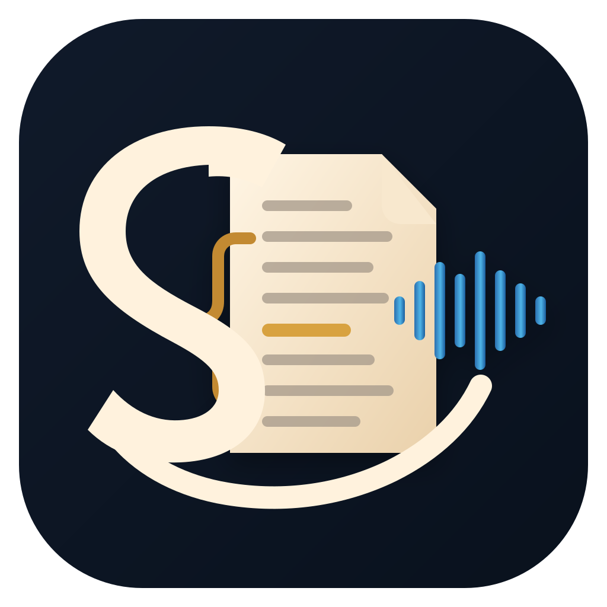

# Scholion application icon

Scholion's application icon represents the product it became: a private workspace for **recorded evidence and annotation**, not a generic transcription utility.

The reviewed visual authority is `frontend/src-tauri/icons/scholion-master.svg`. Platform-specific native assets must be generated from that master rather than treated as independent designs.

## Product metaphor

The mark combines three ideas without trying to draw all of them literally:

1. **evidence page / source**: a stable page-like field;
2. **marginal annotation**: an attached brace/stroke that marks the source rather than replacing it; and
3. **recorded time**: a restrained waveform/timeline gesture that remains secondary to the evidence metaphor.

The surrounding `S`-shaped annotation stroke gives the mark a Scholion identity without relying on tiny text. The icon should communicate “source + annotation / evidence work” before “audio recorder.”

## Visual constraints

The master is intended to remain:

- square and centered with generous optical padding;
- legible at 16×16 and 32×32 without relying on tiny text/details;
- recognizable as a silhouette at normal taskbar/dock sizes;
- free of the word `Scholion` or any text that becomes illegible at small sizes;
- free of literal microphones, headphones, play buttons, cloud/network motifs, or AI sparkle clichés;
- built from a small number of strong shapes with clear negative space;
- usable against both light and dark system chrome;
- safe under macOS rounded-square masking and Windows icon presentation; and
- visually compatible with every Scholion theme without belonging to one theme skin.

The icon is product identity, not evidence/research state. Theme switching must never recolor the installed application icon dynamically.

## Approved direction

The approved master uses a compact **page/evidence tile with a marginal brace and one restrained recorded-time waveform**, wrapped by a large `S`-shaped annotation gesture. The page is warm paper/ivory against a dark durable field, with restrained gold and blue secondary accents.

The tone is scholarly without becoming faux-antique: modern geometric construction, no quills, scrolls, wax seals, columns, books-with-tiny-pages, or illuminated-manuscript micro-detail.

## Asset custody

`frontend/src-tauri/icons/scholion-master.svg` is the reviewed master and visual authority.

`frontend/src-tauri/icons/icon.png` remains the checked-in pre-production placeholder required by the current native source build. Packaging will replace it with a master-derived PNG at the same time the complete native icon family is generated and wired.

Packaging generates the platform derivatives required by Tauri, including Windows `.ico`, macOS `.icns`, and the required PNG sizes. Generated derivatives are build assets; the reviewed SVG master remains the visual authority.

Do not regenerate platform assets from a screenshot, compressed chat preview, or different visual revision on each operating system.

## Packaging acceptance checks

Before packaging freezes the generated native family:

- inspect at 16, 20, 24, 32, 48, 64, 128, 256, 512, and 1024 px;
- inspect on light, dark, and mid-tone neutral backgrounds;
- inspect under a rounded-square mask and with no mask;
- verify the smallest sizes still show one source shape and one annotation gesture;
- verify no tiny stroke turns into visual noise;
- verify there is no accidental resemblance to a microphone, chat bubble, document-upload icon, or generic AI sparkle mark; and
- keep the same approved master across Windows/macOS/Linux derivatives even while official Linux binary packaging remains blocked by issue #135.

Issue #145 owns selection and commitment of the final master. Platform derivative generation and replacement of the current Tauri PNG placeholder belong to the subsequent packaging milestone.
