# Your notes should survive the machinery 📝🦝

Scholion keeps **your evidence notes, tags, collections, and saved searches** beside
recorded evidence without pretending they are part of the transcript itself.

The recording and canonical transcript describe evidence. An evidence note such as “compare
this with the 2024 survey” is something **you know, suspect, or want to remember about a
specific verified passage**. Scholion keeps those kinds of truth separate while still
letting them meet through exact evidence coordinates.

## What counts as a note today?

Scholion currently has one first-class note object: **an evidence note**.

A `ResearchNote` always has:

- a durable note ID and human-authored body;
- an exact `EvidenceAnchor` naming document identity, canonical SHA-256, canonical segment
  IDs, and source-relative time coordinates;
- tag and collection relationships; and
- created/updated timestamps used for durable history and optimistic concurrency.

That mandatory anchor is a useful semantic promise. A note in today's model means “this
human observation is attached to this exact recorded evidence.” It does **not** mean any
arbitrary piece of prose stored somewhere in the application.

Other Research objects have different jobs:

| Object | What it means | A note? |
|---|---|---|
| Evidence note | human interpretation/observation attached to exact canonical evidence | **Yes** |
| Tag | reusable organizational label | No |
| Collection | reusable grouping/navigation structure | No |
| Saved search | durable research question plus typed retrieval intent | No |
| Speaker display name | human label for an anonymous machine-produced speaker reference | No |

Keeping those roles explicit matters for export, deletion, backup, search, and provenance.

### Future freeform notebook pages

A general scratchpad or notebook is a useful later Research capability, but it should be a
**second knowledge primitive**, not an evidence note with a nullable anchor.

Conceptually, a future `ResearchDocument` or `ResearchMemo` would be authoritative SQLite
state with its own ID, title/body, tags/collections, created/updated timestamps, and optional
explicit references to evidence notes or evidence anchors. Unanchored prose would remain
honestly unanchored. When a user cites evidence inside a memo, that relationship could still
carry the exact document/canonical/segment/time identity Scholion already knows how to
verify.

That model supports a natural workflow:

```text
verified passage -> evidence note -> synthesis memo/notebook page
                              \-> another memo
```

A future export can then render a memo to Markdown, plain text, HTML, or a portable research
bundle while preserving explicit evidence references as structured provenance. The export
format should be a derived presentation, not the authority for the note itself.

This is deliberately post-first-release work. Before backup/restore and research
portability are frozen, their manifests should be extensible enough to carry a future
research-document class without pretending it exists today.

## The short version

When you attach a note to transcript evidence, Scholion stores the note durably and keeps
its exact evidence address:

- document/transcript identity;
- original source SHA-256;
- canonical transcript SHA-256;
- canonical segment IDs; and
- source-relative start/end seconds.

The note survives search-index and research-projection rebuilds.



[Diagram source (Mermaid)](./diagrams/src/docs/research-notes-1.mmd)

Text fallback: verified canonical evidence anchors durable SQLite research state; a
transactional journal projects that authority into rebuildable DuckDB query state; the
desktop Research workspace consumes the same authority rather than inventing a
browser-owned notebook.

You do not need to operate either database. `ResearchWorkspaceService` presents one
research workspace over the two storage roles.

## Add, edit, organize, delete, and reopen notes

The CLI anchors to real canonical segment IDs rather than a disposable search row or
formatted timestamp:

```bash
scholion library notes add TRANSCRIPT_ID segment-000042 \
  --body "Check this against the 2024 survey." \
  --tag methodology \
  --tag housing \
  --collection "Chapter 3"
```

A note may span several **contiguous canonical segments**. Scholion verifies the current
canonical transcript bytes and refuses missing, reordered, or non-contiguous selections.
Optional `--start-seconds` and `--end-seconds` may narrow an anchor inside that verified
span.

The desktop uses that same rule when a note is created from the Evidence reader. It sends
document/generation identity and canonical coordinates through one narrow bridge method. If
the library moved to a newer canonical generation before Save, the write is refused instead
of silently attaching the note to different evidence.

Existing notes can be edited in the Research workspace. A desktop edit replaces note body,
tag assignments, and collection assignments **atomically in authoritative SQLite** and
emits one projection-journal event. The note's evidence anchor is not rewritten.

Desktop edit/delete carries the note's authoritative `updated_at` version. If a CLI or
another local surface changed that note after it was displayed, Scholion refuses the stale
write and asks the user to refresh.

A note can reopen the exact canonical generation it cites. The backend reuses the same
canonical verifier as search navigation: it hashes the stored canonical bytes, checks the
stored source and document identities, validates the stored segments and timing, expands
context, and resolves speaker display labels for that exact generation. React does not
choose a replacement generation.

That means an older note has three honest outcomes:

1. the older canonical generation is still present and verifies, so Scholion opens it and
   labels it as older evidence;
2. the stored canonical bytes, identity, segments, or timing no longer verify, so Scholion
   refuses to present them as evidence; or
3. the old evidence is unavailable, so the durable note remains but its cited evidence
   cannot currently be reopened.

There is deliberately no “close enough, use the current transcript” fallback.

Deletion remains explicit and narrow: deleting a note deletes that human-authored note. It
does not delete the canonical transcript or original recording.

## Navigate by tags and collections

Tags and collections are first-class desktop navigation affordances, not decorative pills.
Clicking a label asks the backend for authoritative filtered notes through the existing
`ResearchWorkspaceService` filter contract. React does not filter a capped overview
snapshot or recreate projection rules in the browser.

Multiple selected labels use **AND semantics**: every selected tag and every selected
collection must match the same note. The Research surface keeps active filters visible and
preserves the note → verified-evidence path from filtered results.

## Search transcript evidence with research context

Research metadata can constrain transcript retrieval before scoring:

```bash
scholion library search "housing affordability" \
  --tag methodology \
  --with-notes
```

Or require terms in attached notes while searching transcript evidence:

```bash
scholion library search "housing affordability" \
  --note-text "2024 survey" \
  --collection "Chapter 3"
```

Scholion resolves human names to durable IDs, obtains a canonical evidence scope from the
research projection, and ranks lexical/semantic candidates **inside that scope**. It does
not retrieve the whole corpus and throw away results afterward.

The desktop now exposes the complete first-release search contract without making users
operate the backend vocabulary. The default **Match** control is:

- **Any of these words**;
- **All of these words**; or
- **Exact phrase**.

The GUI compiles that human choice into the same typed phrase/operator request that Python
validates and canonicalizes. Retrieval mode becomes **Search by: Wording / Meaning /
Wording + meaning**; sorting becomes **Order results by: Relevance / Time**. Speaker,
language, transcript, tag, collection, note-text, result-count, and context controls live
under **Search options**.

Backend retrieval provenance is still inspectable under **Technical details**. It is not
required reading for someone trying to find an interview passage.

See **[Research search](research-search.md)** for the full boundary.

## What if the transcript changes?

A note belongs to the **exact canonical transcript generation** it was written against.
If a regenerated transcript reuses the same friendly `segment-000042` under a different
canonical SHA-256, Scholion does **not** silently move the old note.

The old note remains durable historical user state. The projected evidence key includes
canonical generation identity so stale annotations cannot accidentally attach to new
evidence. Editing prose or labels on that old note still leaves its original anchor
unchanged.

### Review and deliberately re-anchor an older note

The desktop has an **Evidence maintenance** surface for notes whose anchor is not the
current canonical generation. Review is read-only. Scholion classifies the stored anchor as:

- **current verified**: it already points to the current verified generation;
- **older verified**: the exact stored generation still verifies and remains legitimate
  historical evidence; or
- **unavailable**: the stored generation cannot currently be verified on this machine.

Older does not mean broken. An older verified anchor can remain exactly where it is for as
long as the user wants.

For a non-current anchor, Scholion may prepare a **current-generation candidate** only when
the current library document has the same durable document identity and recorded-source
SHA-256. Candidate coordinates are derived from the note's source-relative time span and
verified through the normal evidence locator. Scholion does not search another recording
for something that looks similar, and React never chooses a canonical path or generation.

Re-anchoring requires a second explicit confirmation carrying both the note's `updated_at`
version and the candidate canonical SHA-256 the user reviewed. If the note or transcript
changes before confirmation, Scholion refuses the mutation and requires another review.

A successful re-anchor is one authoritative SQLite transaction:

1. copy the old evidence anchor and segment identities into durable anchor history;
2. replace the note's current anchor with the reviewed same-source candidate;
3. advance the research projection journal once; and
4. commit all three together or roll all three back.

The old anchor therefore does not vanish. Re-anchoring changes **which evidence the note
currently points to**; it does not rewrite the fact that the note used to point somewhere
else.

## Why two databases?

| Store | Job | Rebuildable? |
|---|---|---|
| SQLite research state | authoritative notes/tags/collections/saved searches, current evidence anchors, and superseded anchor history | **No** |
| DuckDB research projection | fast derived relationships and lexical note terms | Yes |
| DuckDB transcript index | transcript terms/segments for lexical ranking | Yes |
| DuckDB semantic index | chunks/vectors for semantic retrieval | Yes |

SQLite fits frequently mutated transactional user state. DuckDB fits local analytical
query workloads. Scholion deliberately does **not** make both authoritative.

If the stores disagree, SQLite wins. If DuckDB disappears, rebuild it.

## Saved searches are durable questions, not screenshots

Saved searches persist typed query intent and re-resolve current evidence rather than
freezing result snapshots. The desktop supports create, inspect, run, rename/replace, and
delete. Whole-intent replacement uses optimistic concurrency through authoritative
`updated_at`.

Saving a search keeps the question and its choices. Running it later re-derives the current
research evidence scope and searches the current corpus; runtime `evidence_scope` is never
persisted as user intent.

The desktop now labels these as **Saved searches**, **Save search**, and **Update saved
search** rather than requiring the user to understand “typed intent.” The typed intent still
exists in Python and SQLite; only the default product language changed.

## Operational logs are not a shadow research archive

Research operations use the normal structured application logger for operational evidence:
operation names, durable object IDs, canonical generation identity where relevant,
retrieval mode, counts, current/older state, and success/failure outcome.

The logger does **not** receive note bodies, saved-query text, saved-search names or
descriptions, or raw canonical/source paths from these Research operations. The durable
research stores remain the authority for human-authored content; logs do not become a
second notebook.

## First-release Research status

The first-release Research tranche is complete across:

- authoritative evidence notes/tags/collections;
- unified discovery;
- note create/edit/delete and label mutation;
- exact-generation evidence return;
- saved-search lifecycle and whole-intent replacement;
- explicit stale/unavailable-anchor review and provenance-preserving re-anchor; and
- phrase/ANY/ALL, speaker/language/transcript constraints, research filters, retrieval mode,
  sort, result count, and context controls.

Further Research work is polish or post-MVP rather than the next critical-path blocker.
Selected evidence packets, freeform research memos/notebook pages, REFI-QDA
interoperability, saved-question snapshots/diffs, comparison workspaces, evidence-linked
writing/script boards, portable research bundles, and live provisional capture remain
deliberately later work. See **[Post-MVP research roadmap](post-mvp-roadmap.md)**.

The product does not currently provide freeform notebook pages, rich-text/WYSIWYG editing,
semantic embeddings over note prose, **automatic** cross-generation re-anchoring, or
collaborative sync.
