# 🕰️ Transcript time without calculator gymnastics

A transcript is much more useful when “where did they say that?” has an answer a human can
actually use.

Scholion keeps **one durable numeric source-relative timeline** and derives familiar
clock-style coordinates from it.

If a passage begins `4788.37` seconds into a recording, Scholion can present:

```text
01:19:48.370
```

The numeric coordinate is the anchor. The clock string is presentation.

## What word timestamps add

A segment may span several seconds, while native word timing can preserve finer canonical
positions:

```text
"housing"  → 4788.370 s → 01:19:48.370
"cost"     → 4788.910 s → 01:19:48.910
"problem"  → 4791.125 s → 01:19:51.125
```



[Diagram source (Mermaid)](./diagrams/src/docs/time-navigation-1.mmd)

Text fallback: one canonical numeric time drives human clock display, verified search
navigation, durable research anchors, the desktop evidence cursor, and verified local
media playback through the native host.

## Can search find the exact place now?

Yes, when the retrieval evidence justifies that precision.

The library navigation layer reopens the exact canonical transcript, verifies its
SHA-256, and resolves a ranked search result back to canonical segments and aligned words.
For lexical search, matching aligned words can become exact highlighted evidence and the
first matched word becomes the preferred source seek coordinate.

Semantic-only retrieval is intentionally less precise. An embedding can say “this passage
is related” without identifying one exact matching word, so Scholion exposes the verified
passage and its start time rather than fabricating a word highlight.

## Can I click a word and jump around now?

**Yes. The evidence cursor and verified native player now share the same source-relative coordinate.**

The Library screen can open a verified Evidence reader. Canonical timed words are
interactive: selecting one moves the reader's evidence cursor to that exact
source-relative coordinate, while **Return to match** restores the backend-selected seek
position.

Preparing playback submits that current coordinate with the exact canonical generation.
Python re-verifies the original source and transcript identity, then Rust opens the source
behind an opaque local media session. React receives playback state and coordinates, not a
raw source path or general filesystem authority.

Normal media transport and seeking stay in the native/WebView media layer after the
session is authorized. Scholion does not re-hash a multi-gigabyte source on every seek.
See **[Verified native playback](native-playback.md)** for the authorization and range-stream
contract.

## What about notes and annotations? 📝

Notes are implemented durable user-authored state. `EvidenceAnchor` reuses the same
canonical/source-relative coordinate system as search navigation:

```text
document ID
source SHA-256
canonical transcript SHA-256
canonical segment ID(s)
numeric start/end seconds
```

The CLI can add a note to a canonical segment:

```bash
scholion library notes add JOB_ID segment-000042 \
  --body "Compare this with the 2024 survey."
```

The desktop Evidence reader and Research workspace both consume the verified
segment/word coordinate system. Current evidence can accept a new durable note; older
research anchors can reopen the exact preserved canonical generation without silently
rebinding it to the current transcript.

A note should not anchor only to a rendered clock such as `01:19:48.370`, because that is
presentation. It also should not anchor only to a semantic-search chunk ID because chunks
and indexes are rebuildable.

If an index is rebuilt, the note remains attached to durable evidence. If the canonical
transcript changes, Scholion keeps the note but treats its old generation as stale rather
than silently moving the annotation.

## Do internal work chunks reset the clock?

No. Scholion uses application-owned work windows so long recordings can be processed and
checkpointed safely. Those windows are implementation detail.

When a work window starts at `4200` seconds and faster-whisper reports a word at `588.37`
seconds inside that window, assembly rebases it onto the source timeline:

```text
4200.000 + 588.370 = 4788.370 seconds
                       ↓
                 01:19:48.370
```

The published coordinate never resets to zero because Scholion created a new work file.

## What if the media already declares a timecode?

That is a **different clock**.

Some media may declare `timecode` and `creation_time`. Scholion preserves those declarations
with their format/stream origin. It does not silently decide that a device tag is true.
Devices can have wrong clocks, copied metadata, conflicting tags, or SMPTE semantics that
require more information before arithmetic is safe.



[Diagram source (Mermaid)](./diagrams/src/docs/time-navigation-2.mmd)

**Elapsed time answers:** where is this inside the selected recording?

**Declared media metadata answers:** what other clock information did the source claim to
have?

Those are useful together. They are dangerous when collapsed into one mystery field called
`timestamp`.

## Why not immediately add elapsed time to SMPTE timecode?

Because SMPTE-style timecode can depend on frame rate and drop-frame/non-drop-frame
semantics. Scholion preserves source declarations **without inventing a mapping it cannot
yet qualify**.

## What you get now

| Need | Current behavior |
|---|---|
| Human elapsed display | derived from canonical numeric seconds |
| Search result navigation | verified canonical location plus numeric/human seek coordinate |
| Exact lexical word match | highlighted aligned words when canonical timing evidence supports it |
| Semantic-only result | verified passage coordinate without fabricated word precision |
| Neighboring reading context | bounded canonical segment expansion after ranking |
| Desktop word interaction | canonical timed words move the evidence cursor; Return to match restores backend seek |
| Durable notes/annotations | verified evidence anchors stored with authoritative user state |
| Play original audio/video | generation/source-verified Tauri session from the same evidence cursor |
| Multi-audio playback | intentionally refused until native track selection can prove the transcribed stream |
| SMPTE frame arithmetic | intentionally not inferred without qualified frame semantics |

## The small rule underneath all of this

**Store evidence coordinates. Derive pretty clocks. Preserve source claims. Do not confuse
the three.** ✨

For the exact implementation contract, see
**[Media normalization and transcript timeline](architecture/media-and-timeline.md)**,
**[Word-level timestamp alignment](architecture/word-alignment.md)**,
**[Evidence-first corpus search](architecture/corpus-search.md)**,
**[Verified native playback](native-playback.md)**, and
**[Your notes should survive the machinery](research-notes.md)**.
